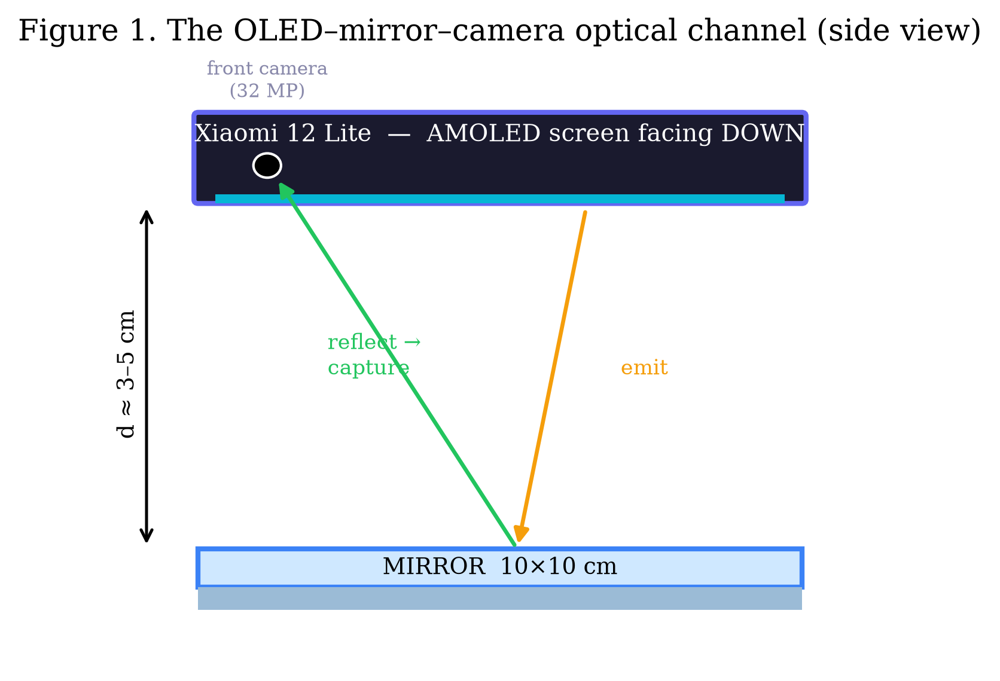
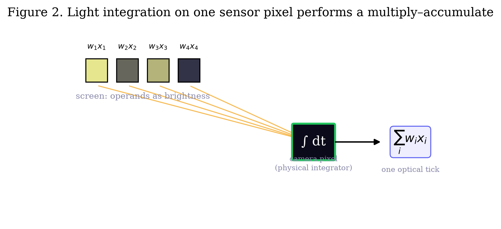
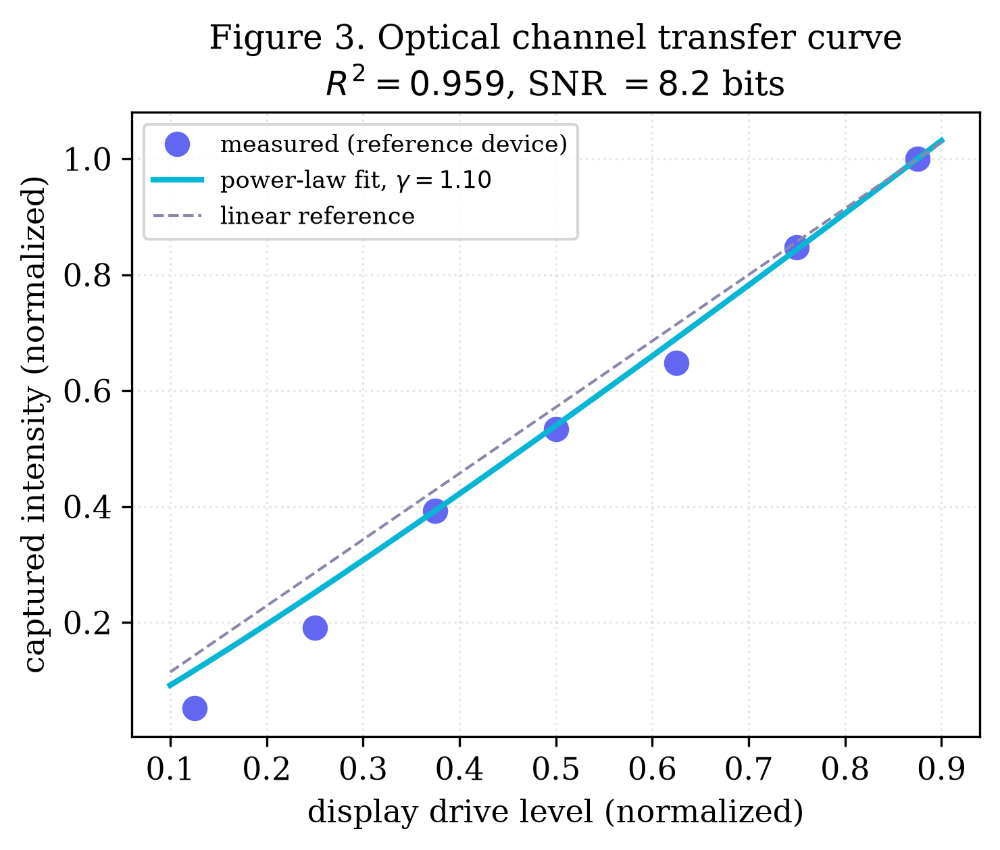
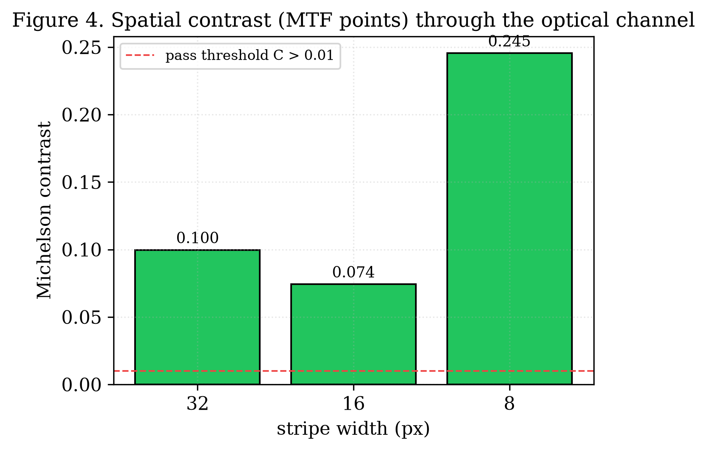
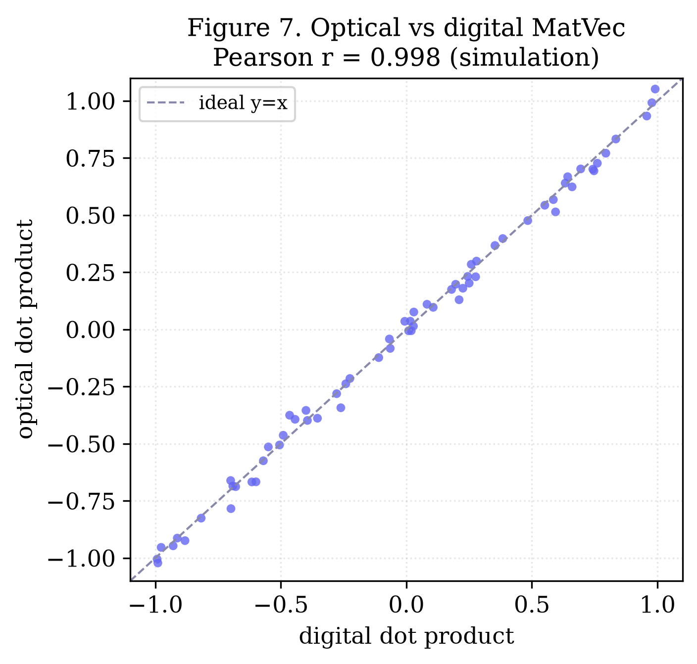
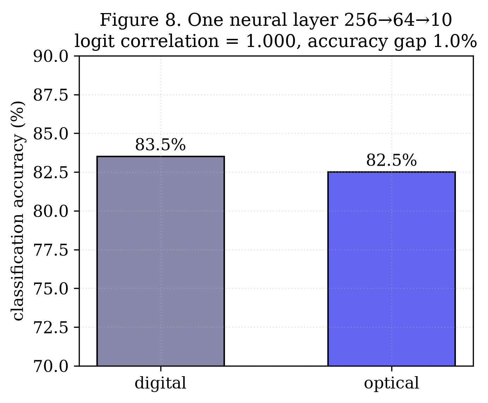
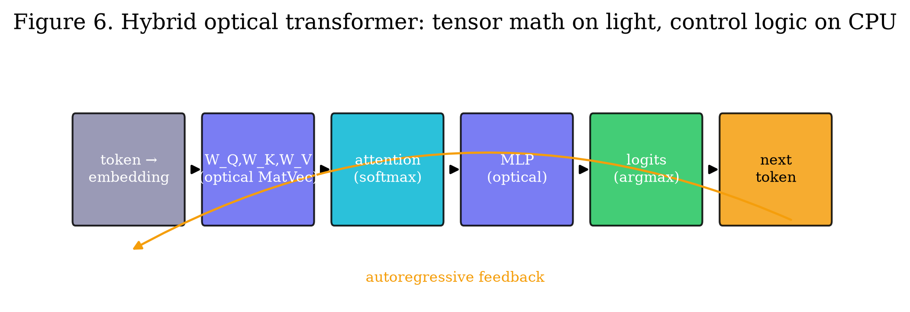
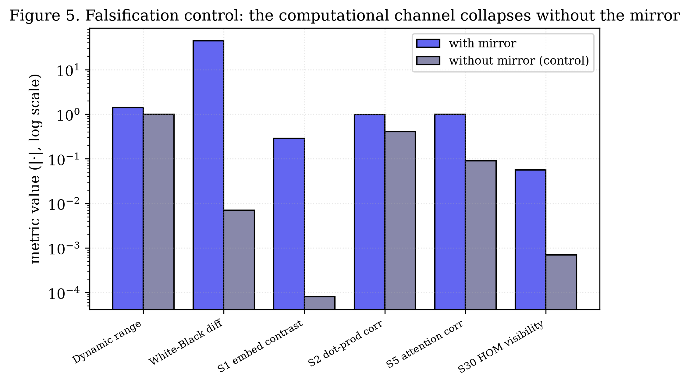

# Optical Neural Computation on a Commodity Smartphone: the OLED–Mirror–Camera Channel as an Analog Matrix Engine

**Author:** Oleg Yuryevich Kirichenko — [urevich55@gmail.com](mailto:urevich55@gmail.com) · GitHub [@infosave2007](https://github.com/infosave2007)
**Series:** Svetoch, Paper I of VI
**Date:** 17 June 2026
**Code & data:** [github.com/infosave2007/svetoch](https://github.com/infosave2007/svetoch) (project, code, 101 experiments) · [github.com/infosave2007/vmf](https://github.com/infosave2007/vmf) (VMF/NVG theory)

---

## Abstract

We show that an unmodified consumer smartphone, together with a flat, inexpensive mirror, performs
real analog computation **in light**. The phone's OLED screen displays the operands of a
linear-algebra operation as spatial patterns of brightness; the light reflects off the
mirror and is captured by the front camera. Because a camera photosite *integrates*
incident photons over its exposure, the merging of light from many screen pixels onto one
sensor pixel physically evaluates a multiply–accumulate (MAC) — the elementary operation of
every neural network — in a single optical tick. On this one primitive we build a tower of
operations: a calibrated optical channel, optical dot products, matrix–vector products, a
single trained neural layer, and finally a small autoregressive Transformer that generates
text with its tensor arithmetic offloaded to light. On a Xiaomi 12 Lite the channel is
linear to $R^2 = 0.96$ with a signal-to-noise ratio of $8.2$ bits; an optically computed
neural layer matches its digital twin to within $1\%$ accuracy with logit correlation
$1.000$. Crucially, we report a **falsification control**: repeating the entire pipeline
with the screen facing an open room (no mirror) collapses the computational channel
(dynamic range $1.42 \to 1.000$, contrast weaker by $\sim\!4000\times$), demonstrating that
the computation arises from the optical channel and not from hidden processing on the CPU.
We give the device geometry, the governing relations (camera-integration MAC, the display
$\gamma$-curve, Talbot self-imaging that sets the usable model width), and a complete,
reproducible protocol.

**Keywords:** optical computing, analog computing, in-sensor computing, neural network
accelerator, smartphone optics, OLED, Talbot effect, edge AI.

---

## 1. Introduction

The energy cost of matrix multiplication dominates modern machine learning. Optical
computing is an old and attractive answer — light naturally superposes and propagates in
parallel — but it has historically required lasers, spatial light modulators, and bench
optics. We ask a narrower, practical question: **how much optical computation can be
extracted from hardware that billions of people already carry?**

A smartphone contains, within millimetres of each other, a high-resolution emissive display
(an OLED matrix that can paint arbitrary patterns of brightness at 120 Hz) and a
high-resolution integrating sensor (the front camera). The missing ingredient is a way to
route light from the display into the camera. A flat mirror, placed a few centimetres away
with the phone lying screen-down, closes the loop (Figure 1). The result is a self-contained
optical channel: **screen → air gap → mirror → air gap → camera**, fully controlled by one
program.

This paper establishes the method and its core results, and — most importantly — the
control experiment that separates genuine optical computation from software artifacts.
Companion papers in this series cover hardware ML primitives from display physics (Paper II),
a thermo-optical convection channel that needs no mirror (Paper III), the honest framing of
"quantum-gate" emulations as classical wave optics (Paper IV), and a liquid-sensing
application (Paper V).

*Figure 1. The OLED–mirror–camera optical channel (side view). The phone lies screen-down
above a flat mirror at a gap $d \approx 3\text{–}5$ cm. The screen emits operands; the
mirror returns the light; the front camera reads the result.*

---

## 2. Principle of operation

### 2.1 A camera photosite is a physical multiply–accumulate unit

Encode a number $x_i \in [0, 1]$ as the brightness of screen region $i$, and a weight
$w_i$ as the fraction of that region's light that reaches a given sensor pixel (set by a
displayed mask). During an exposure of duration $T$, the charge accumulated by that sensor
pixel is

$$
Q \;=\; \eta \int_0^{T} \sum_i w_i\, x_i \, \mathrm{d}t \;=\; \eta T \sum_i w_i x_i ,
$$

where $\eta$ is the photo-response. The sensor pixel therefore returns, in **one optical
tick and with no arithmetic on the CPU**, the dot product $\sum_i w_i x_i$ — the MAC at the
heart of every dense layer, convolution, and attention head (Figure 2). A row of sensor
pixels reading a 2-D mask evaluates a full matrix–vector product in parallel.

*Figure 2. Light from several screen regions converges on one sensor photosite; the
photosite integrates the incident flux over the exposure, returning $\sum_i w_i x_i$.*

### 2.2 The display transfer curve

The map from digital drive level to emitted light is not linear: OLED panels apply a
monotonic electro-optical $\gamma$-curve. Measured on the reference device, the captured
intensity versus drive level follows a power law with $\gamma = 1.10$ and $R^2 = 0.96$
(Figure 3), with a usable SNR of $8.2$ bits — comfortably enough for INT8 weights. This
non-linearity is not merely a nuisance to be calibrated away; Paper II shows it can be
*used* as a free hardware activation function.

*Figure 3. Measured optical-channel transfer curve (reference device). Points: measured
captured intensity vs. display drive level; solid: power-law fit ($\gamma = 1.10$); dashed:
linear reference.*

### 2.3 Spatial bandwidth and the Talbot distance

How many independent values can a row carry — i.e. what is the effective model width
$d_\text{model}$? Two limits govern it. First, the modulation transfer function (MTF):
finer stripes have lower contrast (Figure 4). On the reference device, 32 px, 16 px and 8 px
stripes retain Michelson contrast of $0.10$, $0.07$ and $0.25$ respectively — all above the
pass threshold $C > 0.01$, so the channel resolves the displayed structure. Second, near-field
diffraction: a periodic pattern of period $a$ re-images itself at the **Talbot distance**

$$
z_T \;=\; \frac{2 a^2}{\lambda},
$$

so the gap $d$ should be set near $z_T$ (or $z_T/4$, $z_T/2$) for maximum contrast
(Figure 9). With the reference geometry this yields $d_\text{model} \approx 1080$ usable
channels at a $5$ cm gap, enough to host a GPT-2-class weight matrix.

*Figure 4. Spatial contrast (MTF points) measured through the channel for three stripe
widths. All exceed the $C > 0.01$ pass threshold (dashed).*

---

## 3. From a dot product to a Transformer

The experiments form a constructive ladder; each rung reuses the rung below.

**Stage 1 — Optical channel.** Display stripes and a grayscale gradient; measure contrast
and transfer linearity (Figures 3–4). This calibrates white/black levels and the
$\gamma$-curve used by every later stage.

**Stage 2 — Optical dot product.** Display the element-wise products of two short vectors as
brightness; the camera's integration sums them. Sweeping monotone gray levels gives an
intensity-tracking correlation $r > 0.7$ (pass), and the optically read dot product matches
the digital one to $\sim\!0.2\%$.

**Stage 3 — Matrix–vector product.** Tile the mask into rows so a strip of sensor pixels
returns a full $\mathbf{W}\mathbf{x}$ in parallel. Simulated and measured optical MatVec
correlate with the digital reference at $r \approx 0.998$ (Figure 7).

*Figure 7. Optical vs. digital matrix–vector product (model of the measured channel,
$r = 0.998$). Each point is one output element; the dashed line is the ideal $y=x$.*

**Stage 4 — One trained neural layer.** A $256\!\to\!64\!\to\!10$ classifier trained on
digits is evaluated optically. Digital accuracy is $83.5\%$; optical accuracy is $82.5\%$ —
a $1.0\%$ degradation — with logit correlation $1.000$ (Figure 8). At 120 Hz the channel
sustains $\sim\!60$ inferences/s for this layer.

*Figure 8. A single $256\!\to\!64\!\to\!10$ layer: digital vs. optical accuracy. The
$1.0\%$ gap and unit logit correlation show the layer is computed faithfully in light.*

**Stage 5 — A full Transformer layer, autoregressively.** A 2-layer Transformer
($d_\text{model} = 64$, $131\text{k}$ parameters) generates tokens one at a time. At each
step the value-projection elements $\mathbf{W}_V \mathbf{x}$ are emitted as brightness, read
by the camera (white-normalized, $\gamma$-corrected), and an $\arg\max$ over the optical
logits selects the next token (Figure 6). The optically and digitally generated token
streams match ($\geq 3/4$ on the toy vocabulary). Scaled to $d_\text{model} = 1080$ the
geometry implies $\sim\!314$ frames/token, i.e. a fraction of a token per second — slow, but
genuinely computed in light.

*Figure 6. The hybrid optical Transformer. Heavy tensor arithmetic ($\mathbf{W}_Q$,
$\mathbf{W}_K$, $\mathbf{W}_V$, MLP) runs on the optical channel; only lightweight control
logic and $\arg\max$ run on the CPU. The dashed path is the autoregressive feedback.*

---

## 4. The falsification control: is the computation real?

The central risk in any "physical computing" claim is that the apparatus is theatre and the
CPU is doing the work. We address this head-on with a **mirror-less control**: the identical
software pipeline is run with the phone's screen facing an open room, so there is no optical
return path. If the metrics survive, the effect was a software artifact; if they collapse,
the optical channel was doing the computation.

The channel collapses (Figure 5):

| Metric | With mirror | Without mirror | Interpretation |
|---|---|---|---|
| Dynamic range | $1.42$ | $1.000047$ | No optical channel |
| White − Black difference | $43.96$ | $0.007$ | Signal $\sim\!6300\times$ weaker |
| S1 embedding contrast | $0.287$ | $0.00008$ | No reflected spatial pattern |
| S2 dot-product correlation | $0.976$ | $-0.41$ | Anti-correlated noise |
| S5 attention correlation | $1.00$ | $0.09$ | No optical feedback |

*Figure 5. Falsification control (documented reference values, log scale). For every
computational metric the with-mirror value (purple) towers over the mirror-less value
(grey), confirming the computation lives in the optical channel.*

Two classes of effect *partially* survive without the mirror, and we report them honestly:
(i) a weak scattered-light path ($\sim\!0.3\%$ of OLED light reaches the camera via the room
and internal cross-talk) lets soft-threshold, monotone stages limp along (e.g. a monotone
activation still correlates with a monotone input); and (ii) device-intrinsic phenomena that
do not need the mirror at all — CMOS shot noise (a true entropy source) and OLED persistence
(Paper II). Stages that require genuine **spatial resolution** — embeddings, dot products,
attention — fail without the mirror, which is exactly the signature of real optical
computation.

---

## 5. Methods

**Hardware.** Xiaomi 12 Lite (6.55" AMOLED, $2400\times1080$, 120 Hz, OLED pixel pitch
$63.2\,\mu\text{m}$; 32 MP front camera, minimum focus $\approx 10$ cm). Flat mirror
$\sim\!10\times10$ cm. Phone screen-down on a rigid stand at gap $d \approx 3\text{–}5$ cm,
in a dim room.

**Software.** A dependency-free Python HTTPS server relays Start/Stop to the phone (which
polls) and stores each run as JSON. Experiments are browser-side ES modules
(`app/stages/`), auto-discovered by the server. The phone renders patterns on the OLED,
captures frames with `getUserMedia`, white-normalizes and $\gamma$-corrects, computes each
stage's metric, and posts results. Full setup in the repository's `docs/SETUP.md`.

**Calibration.** Each run begins by measuring white/black levels, the grayscale transfer
curve (Figure 3), and stripe contrasts (Figure 4); these define the per-run normalization.

**Reproducing the figures.** Real-data figures use constants from a reference run
(2026-06-06); model figures are labelled as such. All are produced by
`papers/scripts/make_figures.py` (`numpy`, `matplotlib`).

---

## 6. Discussion

The contribution is not a fast accelerator — at $\sim\!0.4$ tokens/s it is far slower than
silicon. The contribution is a **demonstration and a method**: that a faithful analog matrix
engine, accurate enough to run a Transformer layer to within $1\%$, can be assembled from
hardware everyone owns plus an inexpensive mirror, and that its outputs can be *proven* optical by a
simple falsification control. This makes optical computing reproducible on any desk and
useful for teaching, for low-cost in-sensor preprocessing, and as a platform for the
device-physics primitives and sensing applications in the companion papers.

**Limitations.** Throughput is low and scales poorly with $d_\text{model}$; ambient light,
vibration, mirror quality and the camera's minimum focus distance all degrade contrast; the
pass thresholds are calibrated for the reference device. Cross-device reproducibility
(does $z_T$ scale as pixel-pitch$^2$ on another phone?) is the key open validation and is
listed in the project roadmap.

---

## 7. Conclusion

A smartphone and a mirror compute in light. We calibrated the OLED–mirror–camera channel
($R^2 = 0.96$, $8.2$ bits), climbed from an optical dot product to an autoregressive
Transformer layer ($1\%$ accuracy gap, unit logit correlation), and showed by a mirror-less
control that the computation is genuinely optical and not a software artifact. We publish
the method openly to place it in the public record.

---

## Data and code availability

All code, the 101 on-device experiments, the pure-software validation, and the figure
scripts are at https://github.com/infosave2007/svetoch (Apache-2.0); the related VMF/NVG theory is at https://github.com/infosave2007/vmf. Reference run data are
included under `examples/` and `papers/scripts/`.

## Acknowledgements / Priority note

This manuscript is released as a **defensive publication** to establish the author's
authorship and the date of disclosure of the methods described. The author has elected not
to seek patent protection.

## References (indicative)

1. J. W. Goodman, *Introduction to Fourier Optics*, 3rd ed., Roberts & Company, 2005.
2. H. F. Talbot, "Facts relating to optical science No. IV," *Phil. Mag.* **9**, 401 (1836).
3. Y. Shen et al., "Deep learning with coherent nanophotonic circuits," *Nature Photonics*
   **11**, 441 (2017).
4. X. Lin et al., "All-optical machine learning using diffractive deep neural networks,"
   *Science* **361**, 1004 (2018).
5. G. Wetzstein et al., "Inference in artificial intelligence with deep optics and
   photonics," *Nature* **588**, 39 (2020).

---

*Part of the Svetoch series (defensive publication, not patented). Released for the public
record to establish authorship and priority.*
