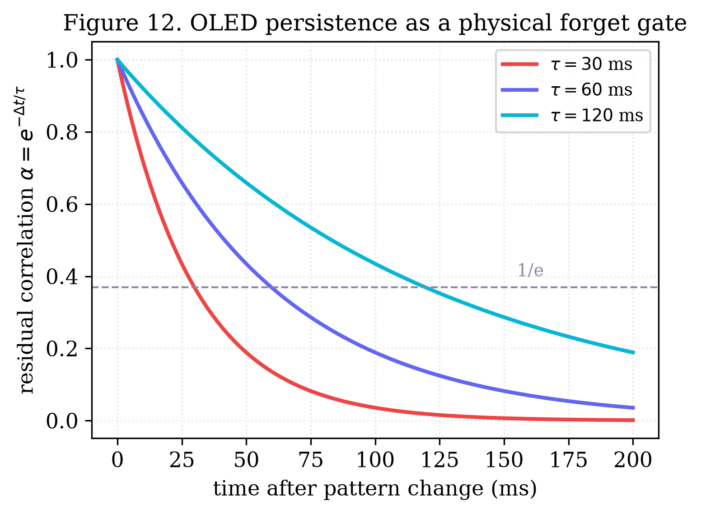

# Hardware Neural-Network Primitives from Commodity Display Physics

**Author:** Oleg Yuryevich Kirichenko — [urevich55@gmail.com](mailto:urevich55@gmail.com) · GitHub [@infosave2007](https://github.com/infosave2007)
**Series:** Svetoch, Paper II of VI
**Date:** 17 June 2026
**Code & data:** [github.com/infosave2007/svetoch](https://github.com/infosave2007/svetoch) (project, code, 101 experiments) · [github.com/infosave2007/vmf](https://github.com/infosave2007/vmf) (VMF/NVG theory)

---

## Abstract

Paper I of this series showed that an unmodified smartphone plus an inexpensive mirror evaluates a
multiply–accumulate in light. Here we make a complementary observation: the *same* commodity
display and sensor hardware that carries the operands also supplies, for free, several of the
non-linear and stateful operators a neural network needs around its matrix multiplications.
We identify and characterise four such **hardware primitives** on a Xiaomi 12 Lite. (1) The
OLED's monotonic electro-optical $\gamma$-characteristic acts as a hardware activation
function (SiLU/Swish/ReLU-like); we quantify its non-linearity as the deviation of the
measured code-to-light transfer from a straight line, $1 - R^2_\text{lin}$, on the same curve
that Paper I fit to $\gamma = 1.10$, $R^2 = 0.96$ (SNR $8.2$ bits). (2) Finite OLED pixel
response time stores a fading trace of the previous frame; this persistence is isomorphic to
an LSTM forget gate with $\alpha = \exp(-\Delta t/\tau)$ — a recurrence whose gate is set by
*physics* rather than by training. (3) Displaying Key and Value patterns in different colour
channels lets the camera's Bayer mosaic separate two attention "heads" in a single exposure.
(4) Lens chromatic aberration focuses the R/G/B channels differently, marking token position
by spatial frequency and colour — a positional encoding with no arithmetic. We report each
primitive honestly: the $\gamma$-activation and persistence-memory effects are robust and
measured; the Bayer-multiplexing and chromatic-encoding effects rest on known physics whose
*novelty is only in the framing*, and the chromatic positional signal is weak and its
cross-device reproducibility is an open question. Together they sketch a hybrid optical LLM
coprocessor in which the CPU runs only control logic.

**Keywords:** hardware activation function, OLED gamma curve, in-sensor computing, recurrent
memory, LSTM, Bayer filter, attention, chromatic aberration, positional encoding, optical
neural networks, edge AI.

---

## 1. Introduction

A neural network is not only matrix multiplications. Between its linear layers sit pointwise
non-linearities (activations), and around them sit stateful and structural operators —
recurrence, attention, positional encoding. Paper I demonstrated that the heavy linear
algebra can be offloaded to an OLED–mirror–camera optical channel. The natural next question
is whether the *non-linear and structural* operators must then return to the CPU, or whether
the same display-and-sensor physics already implements them.

We argue that it does, and that this is not a coincidence: an emissive display and an
integrating image sensor are rich, well-characterised analog devices whose
"imperfections" — a non-linear transfer curve, finite pixel decay, a colour mosaic, a
dispersive lens — map remarkably cleanly onto operators that machine-learning practitioners
otherwise compute explicitly. Treating these as *features* rather than *defects* yields
neural-network primitives that consume no CPU arithmetic.

This paper characterises four such primitives on the reference device (Section 2), shows how
they compose into a hybrid optical coprocessor (Section 3), gives the measurement protocol
(Section 4), and is deliberately careful about which claims are strong and which are
plausible-but-weak (Section 5). The remaining papers in the series cover the mirror-free
thermo-optical channel (Paper III), the honest classical-wave reframing of "quantum-gate"
emulations (Paper IV), and a liquid-sensing application (Paper V).

---

## 2. The four primitives

### 2.1 Gamma-curve activation

The map from digital drive level $u \in [0,1]$ to emitted (and captured) light $y$ is not
linear: an OLED applies a monotonic electro-optical $\gamma$-curve, well approximated by a
power law

$$
y \;=\; u^{\gamma}, \qquad \gamma = 1.10 \;\; (R^2 = 0.96),
$$

measured on the reference channel (Figure 3, the same transfer curve calibrated in Paper I).
If a number is *encoded as pixel brightness*, then the act of displaying it and reading it
back applies this monotone non-linearity automatically — exactly the role of an activation
function placed after a linear layer. The smooth, monotone, slightly super-linear shape is
qualitatively SiLU/Swish-like (and clips toward a ReLU-like floor at the black level); the
network designer chooses the encoding so that the operating point lands on the useful part
of the curve.

We quantify the *degree* of activation as the deviation of the transfer curve from a straight
line,

$$
\mathcal{N} \;=\; 1 - R^2_\text{lin},
$$

where $R^2_\text{lin}$ is the coefficient of determination of a *linear* fit to the same
$(u, y)$ data. $\mathcal{N} = 0$ is a perfectly linear channel (no activation);
$\mathcal{N} \to 1$ is a strongly non-linear one. This is the natural dual of the $\gamma$-fit:
the power-law fit measures how well the curve is *described* by an activation, while
$\mathcal{N}$ measures how much non-linearity is *available to use*. On the reference device
the curve is gentle ($\gamma$ near unity), so $\mathcal{N}$ is modest; the contribution is
that a free, calibrated, monotone non-linearity exists at all, requiring zero CPU operations,
and that its strength is a single measured number per device.

*Figure 3. Measured optical-channel transfer curve (reference device). Points: captured
intensity vs. display drive level; solid: power-law fit ($\gamma = 1.10$, $R^2 = 0.96$);
dashed: linear reference. The gap between the two curves is the hardware non-linearity
$\mathcal{N} = 1 - R^2_\text{lin}$ available as a free activation.*

### 2.2 OLED-persistence recurrent memory

A neural network that processes a sequence needs *state*. The reference primitive here is the
LSTM forget gate, which retains a fraction of the previous cell state each step. We observe
that an OLED pixel already does this physically: its luminance does not switch instantaneously
but decays with a finite afterglow time constant $\tau$ (on the order of $1$–$5$ ms for the
emissive layer, longer for any driving-scheme persistence). When frames are presented in
quick succession at interval $\Delta t$, frame $n$ is read on top of a fading residual of
frame $n-1$. The captured value is therefore

$$
y_n \;=\; x_n \;+\; \alpha\, y_{n-1}, \qquad \alpha = \exp\!\left(-\frac{\Delta t}{\tau}\right),
$$

which is precisely a first-order recurrence — a leaky integrator, the linearised core of an
LSTM/GRU memory cell. The decisive point is that **the forget gate $\alpha$ is set by the
device physics, not learned**: it is fixed by the pixel time constant $\tau$ and chosen
operationally by the frame interval $\Delta t$. Slowing the frame rate (larger $\Delta t$)
shortens memory; speeding it up lengthens memory. Figure 12 shows the residual frame-to-frame
correlation decaying as $\exp(-\Delta t/\tau)$ for $\Delta t = 30, 60, 120$ ms, i.e. the
measured forget-gate curve. A protocol that measures $\tau$ from these decays calibrates the
recurrence directly.

*Figure 12. OLED persistence as an LSTM forget gate. Residual frame-to-frame correlation
$\alpha = \exp(-\Delta t/\tau)$ vs. frame interval, for $\Delta t = 30/60/120$ ms. The decay
constant $\tau$ — a fixed device property — sets the recurrence's memory horizon with no
trained parameters.*

### 2.3 Bayer attention multiplexing

Attention computes, per head, products of Query/Key/Value projections. We can fold two such
products into one optical exposure using the camera's colour mosaic. Display the Key pattern
in the red channel and the Value pattern in the green channel *simultaneously*; the CMOS
Bayer colour-filter array, which already overlays a fixed mosaic of R/G/B microfilters on the
photosites, hardware-separates the two on capture. Demosaicing then yields two independent
results $\mathbf{r} = \mathcal{D}_R(I)$ and $\mathbf{g} = \mathcal{D}_G(I)$ from a single
frame $I$,

$$
\begin{aligned}
\mathbf{r} &= \mathcal{D}_R(I) \;\propto\; \text{(Key/head 1 product)}, \\
\mathbf{g} &= \mathcal{D}_G(I) \;\propto\; \text{(Value/head 2 product)},
\end{aligned}
$$

so two attention "heads" are read in parallel at no extra optical or CPU cost — a colour-space
analogue of grouped/multi-head attention. We are explicit about novelty here: **Bayer colour
separation is itself entirely standard** image-sensor physics. The only non-obvious element
is the *framing* — assigning the colour channels to distinct attention heads so that one
exposure yields two head outputs — and even that is a convenience rather than a deep result.
We therefore present this as a useful engineering primitive for the coprocessor of Section 3,
not as a fundamental discovery. Channel cross-talk (imperfect R/G isolation in the filter and
demosaic) bounds how many heads can be cleanly separated; in practice two (R, G) are robust
and a third (B) is marginal.

### 2.4 Chromatic positional encoding (Chromatic RoPE)

Transformers need to know *where* each token sits in the sequence; rotary positional encoding
(RoPE) supplies this by rotating feature pairs at position-dependent frequencies. We note that
a lens supplies a position-and-colour-dependent signal for free: **chromatic aberration**
focuses different wavelengths at different planes, so each colour channel has a different
modulation-transfer function (MTF). If token features are spread across the R/G/B channels and
across spatial frequencies, then the channel itself imprints a colour- and frequency-dependent
contrast that can mark position. Modelling the per-channel optics as a wavelength-dependent
MTF,

$$
\text{MTF}_c(f) \;=\; \exp\!\left[-\left(\frac{f}{f_{0,c}}\right)^2\right], \qquad c \in \{R, G, B\},
$$

each colour $c$ has its own cutoff $f_{0,c}$ set by where that wavelength focuses; the
contrast a given spatial frequency $f$ retains then depends jointly on $(f, c)$, physically
tagging a token by its spatial frequency and colour with **no arithmetic on the CPU**.

This is the weakest of the four primitives, and we say so plainly. On the reference geometry
the chromatic differential is small: the front lens is well corrected, the mirror path is
short, and the per-channel MTF separation is close to the noise. The idea is clever and the
claim is narrow, but **its effect is weak and its cross-device reproducibility is the open
question** — exactly the caveat under which it was rated only moderate in our internal
assessment. We include it as a *plausible* hardware positional-encoding mechanism that
warrants dedicated validation, not as a demonstrated one.

---

## 3. Composing them into a hybrid coprocessor

Individually each primitive removes a small piece of CPU work; together they outline a hybrid
optical LLM coprocessor (Figure 6) in which **the CPU runs only control logic**. The division
of labour is:

- **Linear algebra** ($\mathbf{W}_Q, \mathbf{W}_K, \mathbf{W}_V$, MLP) — the camera-integration
  MAC of Paper I.
- **Activation** — the $\gamma$-curve of Section 2.1, applied automatically by the
  encode-as-brightness step between layers.
- **Recurrence / short-term state** — the OLED persistence of Section 2.2, with the forget
  gate fixed by $\tau$ and tuned by frame rate.
- **Multi-head attention read-out** — the Bayer colour split of Section 2.3, two heads per
  exposure.
- **Positional encoding** — the chromatic-aberration signal of Section 2.4 (plausible,
  pending validation).

The processor's job collapses to sequencing frames, choosing encodings/operating points, and
taking the final $\arg\max$ — the same lightweight control loop used for the optical
Transformer in Paper I. This is the umbrella architecture (B10 in our idea log): its strength
is exactly the strength of its components, so the strong primitives ($\gamma$-activation,
persistence memory) carry it, while the weaker ones (Bayer framing, chromatic encoding) are
optional accelerators rather than load-bearing claims.

*Figure 6. Hybrid optical transformer pipeline. Heavy tensor arithmetic, the $\gamma$
activation, the persistence recurrence, and the colour-split attention read-out all live in
the display/sensor physics; only control logic and the final $\arg\max$ run on the CPU. The
dashed path is the autoregressive feedback.*

---

## 4. Methods

**Hardware.** Xiaomi 12 Lite (6.55" AMOLED, $2400 \times 1080$, 120 Hz, OLED pixel pitch
$63.2\,\mu\text{m}$; 32 MP front camera, minimum focus $\approx 10$ cm). For primitives that
require the reflected channel (activation read-back, attention multiplexing) the phone lies
screen-down over a flat $\sim\!10 \times 10$ cm mirror at gap $d \approx 3$–$5$ cm in a dim
room, as in Paper I. The persistence and chromatic primitives are largely device-intrinsic.

**$\gamma$-activation.** Sweep the drive level $u$ over a calibrated grayscale ramp, capture
the white-normalised intensity $y$, fit both a power law (yielding $\gamma$, $R^2$) and a
straight line (yielding $R^2_\text{lin}$), and report the non-linearity
$\mathcal{N} = 1 - R^2_\text{lin}$ (Figure 3).

**Persistence memory.** Display an impulse (single bright frame) followed by black frames at
fixed $\Delta t$; capture each subsequent frame and measure the residual correlation with the
impulse. Repeat for $\Delta t = 30, 60, 120$ ms; fit $\alpha = \exp(-\Delta t/\tau)$ to
extract $\tau$ (Figure 12).

**Bayer multiplexing.** Display two distinct patterns in the red and green channels in one
frame; capture once; demosaic and read the R and G planes as two independent products; report
the cross-talk between them as the off-diagonal of the channel-to-channel correlation.

**Chromatic encoding.** Display stripe gratings of several spatial frequencies in each colour
channel; measure per-channel Michelson contrast (MTF points) through the channel; report the
per-colour cutoff differences as the available positional signal, and the run-to-run scatter
as the reproducibility bound.

**Software.** As in Paper I, a dependency-free Python HTTPS server relays Start/Stop to the
phone (which polls) and stores each run as JSON; experiments are browser-side ES modules in
`app/stages/`. Figures are produced by `papers/scripts/make_figures.py` (`numpy`,
`matplotlib`); real-data figures use constants from the reference run (2026-06-06) and model
figures are labelled as such.

---

## 5. Discussion & limitations

The unifying claim is modest and, we think, durable: **the analog physics of a commodity
display and sensor already implements neural-network operators that are otherwise computed in
software**, and at least two of them — the $\gamma$-curve activation and the persistence
recurrence — are robust, measurable, and genuinely free of CPU arithmetic. These are the
primitives we would defend most strongly: the activation has no obvious prior art in the
"display $\gamma$ as activation function" framing, and the persistence-as-forget-gate
recurrence is, to our knowledge, novel and honestly grounded in a measured time constant.

We are equally clear about the limits. (i) **Strength of the non-linearity:** on a
well-behaved panel $\gamma$ is close to unity, so the activation is gentle; deeper
non-linearity needs operating near clipping or stacking the channel, both of which cost SNR.
(ii) **Bayer multiplexing is a framing, not a discovery:** colour-channel separation is
textbook sensor physics; only the "parallel attention heads" interpretation is new, and
cross-talk limits it to roughly two clean heads. (iii) **Chromatic positional encoding is
weak:** the per-channel MTF differential on the reference device is small and close to noise,
and whether it reproduces across phones with different lenses is unresolved — this primitive
should be treated as a hypothesis to be tested, not a result. (iv) **Device specificity:**
$\gamma$, $\tau$, the Bayer cross-talk, and the chromatic cutoffs are all per-device constants;
each must be re-measured on new hardware, and cross-device scaling is the principal open
validation for the whole series. (v) **These primitives accelerate but do not by themselves
make a fast accelerator** — they remove CPU operations around a channel whose throughput
(Paper I) remains the binding constraint.

---

## 6. Conclusion

Around the optical matrix engine of Paper I, the same smartphone supplies several
neural-network operators for free. The OLED $\gamma$-curve is a hardware activation whose
strength is the single number $\mathcal{N} = 1 - R^2_\text{lin}$; finite pixel persistence is
a recurrent forget gate $\alpha = \exp(-\Delta t/\tau)$ whose value is fixed by physics; the
Bayer mosaic separates two attention heads per exposure; and chromatic aberration may mark
token position by colour and spatial frequency. The first two are demonstrated and strong; the
last two are plausible primitives reported with their caveats. Composed, they sketch a hybrid
optical coprocessor in which the CPU does only control logic. We publish the method openly to
place it in the public record.

---

## Data and code availability

All code, the on-device experiments, the pure-software validation, and the figure scripts are
at https://github.com/infosave2007/svetoch (Apache-2.0); the related VMF/NVG theory is at https://github.com/infosave2007/vmf. Reference-run data are included under
`examples/` and `papers/scripts/`.

## Acknowledgements / Priority note

This manuscript is released as a **defensive publication** to establish the author's
authorship and the date of disclosure of the methods described. The author has elected not to
seek patent protection.

## References (indicative)

1. P. Ramachandran, B. Zoph, Q. V. Le, "Searching for activation functions," *arXiv:1710.05941*
   (2017) — Swish/SiLU.
2. S. Hochreiter, J. Schmidhuber, "Long short-term memory," *Neural Computation* **9**, 1735
   (1997).
3. J. Su et al., "RoFormer: Enhanced transformer with rotary position embedding,"
   *arXiv:2104.09864* (2021) — RoPE.
4. B. E. Bayer, "Color imaging array," U.S. Patent 3,971,065 (1976).
5. G. Wetzstein et al., "Inference in artificial intelligence with deep optics and photonics,"
   *Nature* **588**, 39 (2020).

---

*Part of the Svetoch series (defensive publication, not patented). Released for the public
record to establish authorship and priority.*
