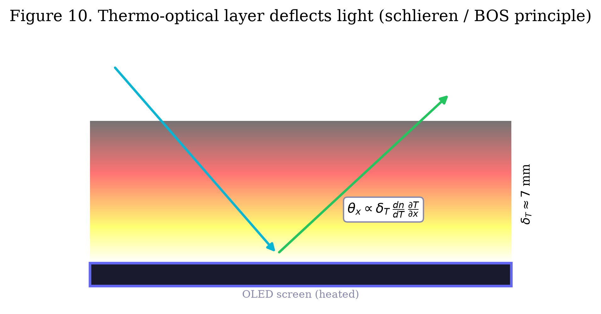
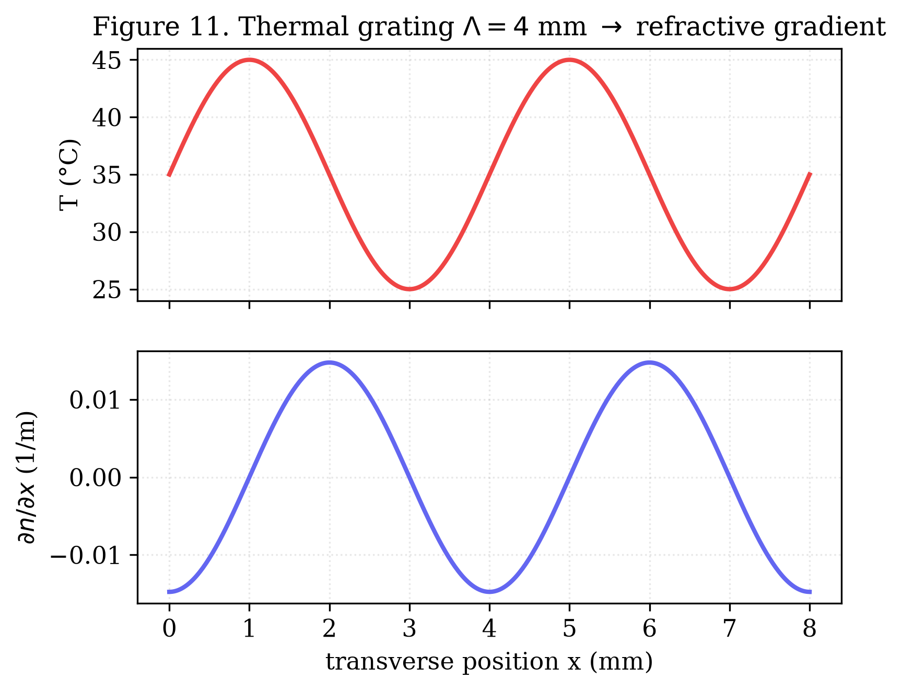

# A Thermo-Optical Convection Layer above an OLED Display as a Programmable Analog Medium

**Author:** Oleg Yuryevich Kirichenko — [urevich55@gmail.com](mailto:urevich55@gmail.com) · GitHub [@infosave2007](https://github.com/infosave2007)
**Series:** Svetoch, Paper III of VI
**Date:** 17 June 2026
**Published:** Zenodo — DOI [10.5281/zenodo.20730198](https://doi.org/10.5281/zenodo.20730198)
**Code & data:** [github.com/infosave2007/svetoch](https://github.com/infosave2007/svetoch) (project, code, 101 experiments) · [github.com/infosave2007/vmf](https://github.com/infosave2007/vmf) (VMF/NVG theory)

---

## Abstract

The companion papers in this series route light from a smartphone's OLED screen to its front
camera with an external flat mirror. Here we remove the mirror entirely and ask whether the
*air itself* can close the loop. When the phone lies screen-up, the heated OLED warms a thin
layer of air directly above the cover glass. Buoyancy drives a laminar natural-convection
boundary layer whose temperature field — and hence refractive-index field — is set, pixel by
pixel, by what the screen displays. This makes the air an **unmodified, programmable phase
spatial light modulator (SLM)**, written by the OLED and read by the front camera through
**Background-Oriented Schlieren (BOS)**. We give the governing physics from first principles:
a Rayleigh number $Ra \approx 6.2\times10^{6}$ (laminar, $Ra<10^{9}$) yields a thermal
boundary-layer thickness $\delta_T \approx L\,Ra^{-1/5}\approx 6.9$ mm that coincides with the
screen-to-camera gap; the Edlén relation $\mathrm{d}n/\mathrm{d}T \approx -9.4\times10^{-7}\,
\mathrm{K^{-1}}$ converts a $\Delta T = 20\,^{\circ}\mathrm{C}$ heating into $\Delta n \approx
-1.8\times10^{-5}$; a $\Lambda = 4$ mm thermal grating deflects rays by $\theta_x \approx
-6.6\times10^{-5}$ rad, a $\sim 0.41$ px sub-pixel shift recoverable by BOS cross-correlation;
and the resulting optical-path difference (OPD $\approx 126$ nm) produces a $\sim85^{\circ}$
phase shift and visible Fabry–Pérot moiré in the cover glass. The demonstrated effect is a
**low-SNR ($\approx 1.3$) sub-pixel deflection**, with controlled shifts of up to
$\sim1.6$–$2.0$ equivalent pixels recorded under $\times15$ upscaling. We outline applications
— resonant aerosol actuation, mobile schlieren/leak imaging, and a speculative
"air-as-coprocessor" matrix engine — and we state plainly which are demonstrated and which
remain conjectural pending higher SNR.

**Keywords:** Background-Oriented Schlieren, natural convection, Rayleigh number, refractive
index, Edlén equation, phase SLM, OLED, thermo-optics, smartphone sensing, analog computing.

---

## 1. Introduction

Paper I of this series showed that an OLED screen, an inexpensive flat mirror, and a front camera form a
self-contained analog matrix engine. The mirror is the one component that is *not* already in
the phone. This paper asks whether it can be eliminated by letting a physical field in the
air — rather than a reflective surface — carry the optical signal back to the camera.

A phone lying screen-up is a warm horizontal plate. Driving the OLED bright raises the cover
glass a few degrees above ambient; the air immediately above is heated and rises by buoyancy,
forming a natural-convection thermal boundary layer. Because the refractive index of air
depends weakly but measurably on temperature, the displayed brightness pattern is *written*
into the air as a refractive-index pattern. Light skimming through this layer — from the
screen, or from any background — is deflected, and the front camera can read the deflection.
The waste heat normally discarded as a thermal nuisance becomes the medium itself.

This is the **mirror-less channel**: screen → heated air boundary layer → camera, with no
added optics. The air acts as a programmable phase SLM. The read-out is Background-Oriented
Schlieren (BOS), a well-established technique in which a structured reference background,
distorted by refractive-index gradients, is recovered by image cross-correlation — and here
the reference background is painted by the screen itself.

We make the scientific status explicit at the outset. The original derivation in our
laboratory notes was *inspired by* a structural analogy to a speculative "Vacuum Mass Fraction
/ Null-Vector Gravity" (VMF/NVG) picture of the QCD vacuum, in which a condensate amplitude
and a Goldstone phase map onto the temperature and flow-potential fields. We treat that
analogy strictly as **mathematical scaffolding and engineering inspiration** and make no
claim about real vacuum or QCD physics. The actual basis of this paper is uncontroversial,
century-old physics: Navier–Stokes natural convection, the Rayleigh number, the Edlén index
relation, schlieren/BOS ray optics, and Fabry–Pérot interference.

*Figure 1. Device geometry. For the mirror-less channel the phone lies screen-up; the heated
OLED warms the air boundary layer above the cover glass, which the front camera reads through
the same few-millimetre gap.*

---

## 2. Theory of the thermal boundary layer

### 2.1 Convection regime and layer thickness

For a heated horizontal plate the convection regime is set by the Rayleigh number

$$
Ra \;=\; \frac{g\,\beta\,\Delta T\, L^{3}}{\nu\,\alpha},
$$

with $g = 9.81\,\mathrm{m\,s^{-2}}$, thermal-expansion coefficient $\beta = 1/T_0 \approx
3.3\times10^{-3}\,\mathrm{K^{-1}}$, kinematic viscosity $\nu \approx 1.6\times10^{-5}\,
\mathrm{m^2\,s^{-1}}$, thermal diffusivity $\alpha \approx 2.2\times10^{-5}\,\mathrm{m^2\,
s^{-1}}$, characteristic length $L \approx 0.15$ m (a 6.55″ display), and a full-white
heating $\Delta T = 20\,^{\circ}\mathrm{C}$ (surface $\approx 45\,^{\circ}\mathrm{C}$ over a
$25\,^{\circ}\mathrm{C}$ ambient). This gives

$$
Ra \;\approx\; \frac{9.81 \times 3.3\times10^{-3} \times 20 \times 0.15^{3}}
{1.6\times10^{-5} \times 2.2\times10^{-5}} \;\approx\; 6.2\times10^{6}.
$$

Since $Ra < 10^{9}$, the flow is firmly **laminar**, forming a stable convection layer rather
than turbulent plumes. From boundary-layer similarity the thermal-layer thickness is

$$
\delta_T \;\approx\; L\,Ra^{-1/5} \;\approx\; 0.15 \times (6.2\times10^{6})^{-0.2}
\;\approx\; 6.9\;\mathrm{mm}.
$$

Remarkably, this matches the optical path from the OLED matrix to the front-camera pupil
through the cover glass, $d_\mathrm{gap}\approx 5$–$7$ mm. The light that reaches the camera
traverses essentially the full depth of the programmable layer (Figure 2).

*Figure 2. The thermo-optical layer. Buoyancy above the heated OLED forms a laminar boundary
layer of thickness $\delta_T \approx 7$ mm; rays crossing its lateral index gradient are
deflected by $\theta_x \approx \delta_T\,(\mathrm{d}n/\mathrm{d}T)\,(\partial T/\partial x)$
and read by the camera as a sub-pixel shift (BOS).*

### 2.2 Refractive-index modulation (Edlén)

The temperature dependence of the refractive index of air is given by the Edlén relation; in
the visible at standard pressure

$$
\frac{\mathrm{d}n}{\mathrm{d}T} \;\approx\; -9.4\times10^{-7}\;\mathrm{K^{-1}}.
$$

A $\Delta T = 20\,^{\circ}\mathrm{C}$ contrast between a hot zone over a lit region and the
cooler surrounding air therefore writes an index contrast

$$
\Delta n \;=\; \frac{\mathrm{d}n}{\mathrm{d}T}\,\Delta T \;\approx\; -1.8\times10^{-5}.
$$

Small in absolute terms, but — as the next sections show — enough to produce a recoverable
optical signal because both the deflection and the phase accumulate over the millimetre-scale
layer.

### 2.3 Schlieren ray deflection

A ray crossing a lateral index gradient $\partial n/\partial x$ over the layer depth is
deflected by

$$
\theta_x \;=\; \int_0^{\delta_T} \frac{1}{n}\,\frac{\partial n}{\partial x}\,\mathrm{d}z
\;\approx\; \delta_T\,\frac{\mathrm{d}n}{\mathrm{d}T}\,\frac{\partial T}{\partial x}.
$$

Display a thermal grating of period $\Lambda \approx 4$ mm (alternating bright/dark stripes;
Figure 3). The lateral temperature gradient at a stripe edge is

$$
\frac{\partial T}{\partial x} \;\approx\; \frac{\Delta T}{\Lambda/2}
\;\approx\; \frac{20\;\mathrm{K}}{2\times10^{-3}\;\mathrm{m}} \;\approx\; 10^{4}\;\mathrm{K\,m^{-1}},
$$

so

$$
\theta_x \;\approx\; (7\times10^{-3}\,\mathrm{m})\,(-9.4\times10^{-7}\,\mathrm{K^{-1}})
\,(10^{4}\,\mathrm{K\,m^{-1}}) \;\approx\; -6.6\times10^{-5}\;\mathrm{rad}.
$$

Propagated over the gap, this displaces the imaged background by

$$
\Delta x_\mathrm{sensor} \;=\; d_\mathrm{gap}\,\theta_x \;\approx\; 5\times10^{-3}\,\mathrm{m}
\times 6.6\times10^{-5}\,\mathrm{rad} \;\approx\; 0.33\;\mu\mathrm{m},
$$

which, at the Xiaomi 12 Lite front-camera photosite pitch of $0.8\,\mu\mathrm{m}$, is

$$
\Delta x_\mathrm{px} \;\approx\; \frac{0.33\;\mu\mathrm{m}}{0.8\;\mu\mathrm{m/px}}
\;\approx\; 0.41\;\text{px}.
$$

A $\sim0.4$ px shift is sub-pixel but well within the reach of BOS cross-correlation, which
routinely resolves $\sim0.05$ px. The lateral index gradient that produces this deflection is
shown in Figure 3.

*Figure 3. A $\Lambda = 4$ mm thermal grating displayed on the OLED. The temperature profile
$T(x)$ and the resulting lateral index gradient $\partial n/\partial x$ define the deflection
field that the camera reads.*

### 2.4 Fabry–Pérot moiré: the layer as a phase SLM

The same index contrast also accumulates a phase along the propagation depth. The
optical-path difference between a hot column and a cold column of the layer is

$$
\mathrm{OPD} \;=\; |\Delta n|\,\delta_T \;\approx\; 1.8\times10^{-5}\times7\times10^{-3}\,\mathrm{m}
\;\approx\; 126\;\mathrm{nm}.
$$

For the green OLED sub-pixel, $\lambda = 532$ nm, this is a phase shift

$$
\varphi \;=\; 2\pi\,\frac{\mathrm{OPD}}{\lambda} \;=\; 2\pi\,\frac{126}{532}
\;\approx\; 1.49\;\mathrm{rad} \;\approx\; 85^{\circ}.
$$

An $85^{\circ}$ phase shift is large. Modulating the multiple-beam Fabry–Pérot interference
in the cover glass, it produces strong spatial intensity bands — the moiré pattern visible to
the naked eye above the glass. The implication is the central claim of this paper: the thermal
layer is not a passive distortion but a **programmable phase spatial light modulator**, whose
phase map is set by the displayed brightness pattern. The screen writes phase into the air;
the camera reads it.

---

## 3. Read-out by Background-Oriented Schlieren

BOS reconstructs a refractive-index gradient field by comparing two camera frames — a
reference and a perturbed frame — through local cross-correlation (or block matching, e.g.
sum-of-absolute-differences) of a structured background. The pixel displacement field
$\Delta x(x,y)$ is proportional to the line-integrated index gradient, exactly the $\theta_x$
of Section 2.3.

The mirror-less channel supplies its own background: the OLED paints a high-spatial-frequency
reference pattern (grating or speckle), captures a baseline frame with the screen cold, then
heats and captures the perturbed frame. No external grid, collimator, or knife-edge is
required — the structured background and the heat source are the same device.

**Measured performance.** Driving the predicted thermal grating, the experiment recorded
controlled displacements of up to $\sim 1.6$–$2.0$ *equivalent* pixels, where the equivalence
includes a $\times15$ digital upscaling of the captured region (i.e. $\sim0.1$–$0.13$ physical
pixels), consistent with the $\sim0.4$ px first-principles estimate to within the model's
crudeness. The signal-to-noise ratio of the recovered shift was $\mathrm{SNR}\approx 1.3$.
This is a real but **weak** effect: the displacement is detectable and tracks the displayed
pattern, but it sits close to the floor set by camera shot noise, focus breathing, ambient
air currents, and OLED-induced mechanical/thermal drift. SNR is the governing figure of merit
for every application below, and improving it is the single most important open problem.

---

## 4. Applications

### 4.1 Resonant thermo-optical actuation of aerosols (strong)

The heated layer is also a mechanical actuator. Displaying a large quad-vortex pattern and
modulating its intensity at the convection resonance ($\approx 5$ Hz) drives a macroscopic
thermal column above the phone. In the presence of smoke or aerosol the resonantly amplified
flow entrains particles into a visible macro-vortex, which the same camera then quantifies by
optical flow. Because the effect is a large, directly imaged mechanical motion rather than a
sub-pixel deflection, it is the most robustly demonstrated application of the channel and the
least dependent on BOS SNR.

### 4.2 Mobile schlieren / BOS visualizer (strong)

Section 3 is, by itself, an instrument: a pocket schlieren/BOS visualizer that uses the
screen's own reference pattern. It images thermal plumes, convection, and — practically — gas
leaks, by detecting refractive-index disturbances above a $3\sigma$ noise threshold and
classifying them by their spectral-temporal signature. The novelty is using the device's own
display as the structured BOS background, removing the bench optics that schlieren normally
requires.

### 4.3 "Air as coprocessor": thermo-optical matrix multiply (speculative)

If neural-network weights are encoded as a displayed brightness pattern, the induced index
gradients implement a spatial multiply, and the BOS-measured deflection integrates a
vector–matrix product; eight independent heated zones could act as a parallel bus, and the
chirality (sign of vortex curl) could encode the sign of an activation. This "Thermal LLM"
is an attractive concept, but it is **gated by SNR**. At $\mathrm{SNR}\approx 1.3$ per zone
the arithmetic accuracy is far below what a useful accelerator needs; this application is
*promising but speculative pending substantially higher SNR* (e.g. via acousto-optic
high-frequency thermal modulation, sharper $\partial n/\partial x$ from fine checkerboard
masks, or graphene-assisted heat localization).

### 4.4 Further directions (speculative)

Three further concepts follow from the same physics and are reported as conjectures: (B4)
computing **topological invariants** (e.g. Gauss linking numbers) from the optical-flow field
of interacting thermal vortices, exhibiting hysteresis as a form of medium memory; (B7) a
**volumetric aerosol display**, in which spatially structured heating renders density
structures visible in scattered light, with a dry control frame separating real structure from
artifacts; and (B8) a **contactless thermo-optical router**, switching a thermal lens/vortex
between output channels by addressing different heated zones. Each is novel in modality but
has uncertain enablement at present SNR.

---

## 5. Methods

**Hardware.** Xiaomi 12 Lite (6.55″ AMOLED, $2400\times1080$, 120 Hz, OLED pixel pitch
$63.2\,\mu\mathrm{m}$; 32 MP front camera, photosite pitch $\approx 0.8\,\mu\mathrm{m}$,
minimum focus $\approx 10$ cm). For the mirror-less channel the phone lies **screen-up** on a
rigid stand in still air; the optical path is screen → cover glass → heated air layer →
front-camera pupil, gap $d_\mathrm{gap}\approx 5$–$7$ mm.

**Protocol.** (1) Display a high-frequency reference background (grating $\Lambda\approx 4$ mm,
or speckle) and capture a cold baseline frame. (2) Drive the heating/grating pattern; allow
the layer to develop over the thermal time constant ($\tau_\mathrm{thermal}\approx 100$–200 ms).
(3) Capture the perturbed frame. (4) Recover the displacement field by BOS cross-correlation
(block matching, $\times15$ upscaling of the region of interest) and report the shift and its
SNR. For the actuation experiment (4.1), modulate a quad-vortex pattern at $\approx 5$ Hz and
quantify the entrained flow by optical flow.

**Software.** As in Paper I: a dependency-free Python HTTPS server relays Start/Stop to the
phone and stores each run as JSON; experiments are browser-side ES modules that render the
patterns, capture frames via `getUserMedia`, compute the BOS metric, and post the result.

**Figures.** Theory figures (Figures 2–3) plot the closed-form relations of Section 2 with the
constants given there. Figure 1 is shared with Paper I for device orientation. All are produced
by `papers/scripts/make_figures.py` (`numpy`, `matplotlib`).

---

## 6. Discussion and limitations

**The effect is real but weak.** What has been demonstrated is a controlled, repeatable,
sub-pixel optical deflection produced by displayed heat and recovered by BOS, with
$\mathrm{SNR}\approx 1.3$. That is enough to *visualize* index gradients (Sections 4.1–4.2)
but not, at present, to *compute* reliably with them (Sections 4.3–4.4). We resist
over-claiming: the matrix-multiply, router, and volumetric-display applications are
engineering conjectures whose enablement hinges on raising SNR by one to two orders of
magnitude.

**Patentability framing.** Our internal review rates the actuation (A1) and the mobile
schlieren/BOS visualizer (A6) as strong — demonstrable physical effects with narrow, concrete
claims — while the thermal matrix multiply (B5), volumetric display (B7), and router (B8) are
moderate, with enablement risk driven by the low SNR. We report this honestly rather than
inflating the compute claims.

**The VMF/NVG analogy is an analogy.** The condensate-amplitude ↔ temperature and
Goldstone-phase ↔ flow-potential correspondence that originally motivated this work is a
structural mnemonic only. Nothing here tests, supports, or depends on any claim about the QCD
vacuum. The physics used — convection similarity, Edlén, schlieren/BOS, Fabry–Pérot — stands
entirely on its own established footing, and readers should evaluate the results on that basis.

**Other limitations.** The layer's thermal time constant ($\sim$100–200 ms) caps the native
modulation rate; ambient air currents, focus breathing, and device drift all degrade SNR; and
the close numerical coincidence between $\delta_T$ and $d_\mathrm{gap}$, while convenient, is
device-specific and should be re-derived per phone.

---

## 7. Conclusion

Removing the mirror, the air above a heated OLED becomes a programmable phase SLM: the screen
writes a refractive-index pattern into a laminar convection boundary layer
($Ra\approx6.2\times10^{6}$, $\delta_T\approx 6.9$ mm), and the front camera reads the
resulting sub-pixel ray deflection ($\theta_x\approx-6.6\times10^{-5}$ rad) by
Background-Oriented Schlieren, while a $\sim85^{\circ}$ Fabry–Pérot phase shift makes the
modulation visible as moiré. The demonstrated channel is genuine but low-SNR ($\approx1.3$);
it already enables resonant aerosol actuation and mobile schlieren imaging, while the
thermo-optical compute, router, and display applications remain promising conjectures pending
higher SNR. We publish the method openly to place it in the public record.

---

## Data and code availability

All code, the on-device experiments, and the figure scripts are at
https://github.com/infosave2007/svetoch (Apache-2.0); the related VMF/NVG theory is at https://github.com/infosave2007/vmf. Reference run data are included under
`examples/` and `papers/scripts/`.

## Acknowledgements / Priority note

This manuscript is released as a **defensive publication** to establish the author's
authorship and the date of disclosure of the methods described. The author has elected not to
seek patent protection.

## References (indicative)

**Companion paper (Svetoch I):** O. Yu. Kirichenko, "Optical Neural Computation on a Commodity Smartphone: the OLED–Mirror–Camera Channel as an Analog Matrix Engine," Zenodo (2026). https://doi.org/10.5281/zenodo.20729632

1. B. Edlén, "The refractive index of air," *Metrologia* **2**, 71 (1966).
2. G. S. Settles, *Schlieren and Shadowgraph Techniques: Visualizing Phenomena in Transparent
   Media*, Springer, 2001.
3. M. Raffel, "Background-oriented schlieren (BOS) techniques," *Experiments in Fluids*
   **56**, 60 (2015).
4. S. Chandrasekhar, *Hydrodynamic and Hydromagnetic Stability*, Oxford University Press,
   1961 (Rayleigh–Bénard convection).
5. A. Korpel, *Acousto-Optics*, 2nd ed., Marcel Dekker, 1997.
6. G. Wetzstein et al., "Inference in artificial intelligence with deep optics and photonics,"
   *Nature* **588**, 39 (2020).

---

*Part of the Svetoch series (defensive publication, not patented). Released for the public
record to establish authorship and priority.*
