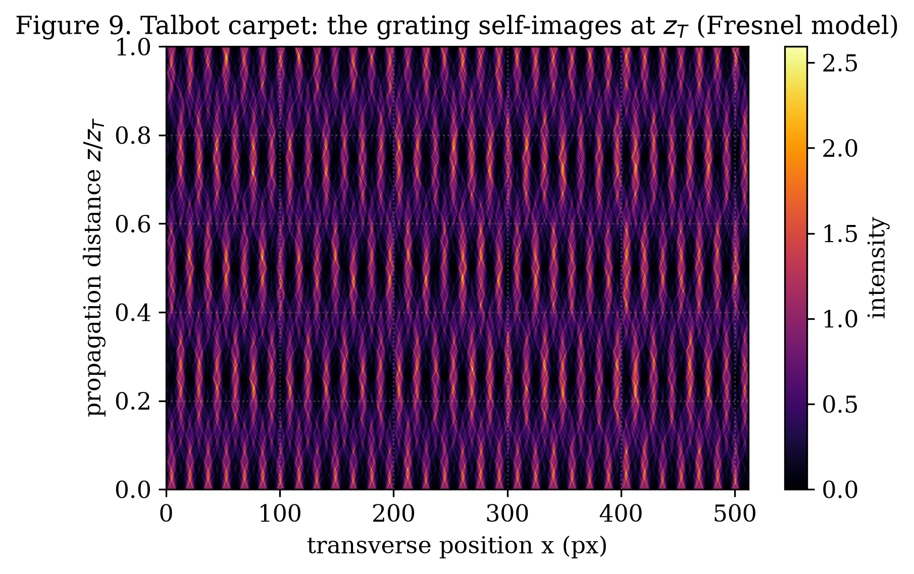
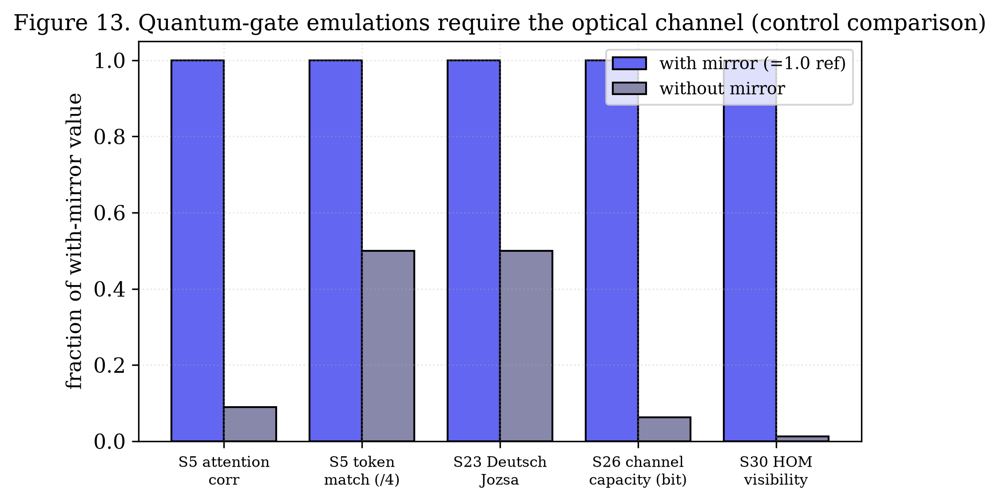

# Classical Wave-Optical Emulation of Quantum-Gate Algebra on a Smartphone, with a Falsification Protocol

**Author:** Oleg Yuryevich Kirichenko — [urevich55@gmail.com](mailto:urevich55@gmail.com) · GitHub [@infosave2007](https://github.com/infosave2007)
**Series:** Svetoch, Paper IV of VI
**Date:** 17 June 2026
**Code & data:** [github.com/infosave2007/svetoch](https://github.com/infosave2007/svetoch) (project, code, 101 experiments) · [github.com/infosave2007/vmf](https://github.com/infosave2007/vmf) (VMF/NVG theory)

---

## Abstract

We describe a family of smartphone experiments that **emulate the linear algebra of quantum
gates using classical wave optics**, and we frame them with deliberate honesty. The Svetoch
platform — an unmodified phone whose OLED screen displays patterns, an inexpensive flat mirror, and the
front camera — has been used to implement procedures labelled "Hadamard", "QFT", "Grover",
"Deutsch–Jozsa", "CNOT", "teleportation", Hong–Ou–Mandel (HOM), CHSH/Bell, and BB84. We state
plainly that **none of these is quantum computation**. There are no single photons, no
entanglement, no Bell-inequality violation, and no quantum no-cloning; the light from an OLED
is bright, classical, and largely incoherent. What the experiments do is encode a "qubit
state" as a spatial/phase pattern of brightness and realize gate operations as classical
interference and Fourier-optical transforms, with "measurement" implemented as $\arg\max$ over
intensities. This is a legitimate and pedagogically valuable *classical analogue* of
quantum-gate algebra, in the tradition of classical optical analogues of entanglement, not a
quantum device. The genuinely defensible contributions are three: (a) a lock-in / phase-
sensitive optical correlator referenced to the 120 Hz display refresh — explicitly a
**classical** correlator, not a Bell test; (b) true random numbers from CMOS shot noise, a
real physical entropy source (with acknowledged prior art); and, most importantly, (c) a
rigorous **falsification protocol** — the mirror-less control — that separates real effects of
the optical channel from CPU artifacts. With the mirror, the emulations produce structured
metrics; without it they collapse to noise and coin-flips (e.g. HOM visibility $0.056 \to
0.0007$; Deutsch–Jozsa correct $\to 50\%$; channel capacity $16 \to 1$ bit). That collapse is
the honesty test, and the method for performing it is this paper's real novelty.

**Keywords:** classical optical analogue, wave optics, Fourier optics, quantum-gate emulation,
lock-in correlator, falsification control, shot-noise TRNG, smartphone optics.

---

## 1. Introduction

Quantum computing is glamorous, and the temptation to call a clever optics demo "quantum" is
strong. A smartphone that displays a two-lobe pattern and reads back an interference fringe
*looks* like a qubit; an $\arg\max$ over two intensities *looks* like a measurement collapse.
The Svetoch repository contains a whole family of such demos, with names borrowed directly
from quantum information science. This paper exists to draw a hard line around what they are.

Our stance is simple and we hold it throughout: **these experiments emulate the
finite-dimensional linear algebra of quantum gates with classical wave optics, and nothing
more.** The mathematics of a single qubit lives in $\mathbb{C}^2$; a Hadamard is a $2\times2$
unitary; the quantum Fourier transform is a DFT. Linear, unitary, finite-dimensional maps can
be realized — approximately and classically — by interference and Fourier optics, because
classical wave amplitudes also superpose linearly. What cannot be realized this way is
everything that makes quantum computation *quantum*: genuine entanglement across a tensor
product, exponential state-space scaling, Bell-inequality violation, and the no-cloning
theorem. We do not claim any of these, and we say so loudly because the credibility of the
whole Svetoch series rests on not overclaiming.

This is Paper IV of five. Paper I establishes the OLED–mirror–camera channel as an analog
matrix engine and the falsification control that underpins the series; Paper II covers
device-physics ML primitives; Paper III a mirror-free thermo-optical channel; Paper V a
liquid-sensing application. Here we (i) explain precisely what is and is not being computed,
(ii) describe the one piece of the "quantum" cluster worth keeping — a classical lock-in
correlator — on honest terms, and (iii) give the falsification protocol that lets anyone tell
a real optical effect from CPU theatre.

---

## 2. What is and isn't being computed

### 2.1 Encoding a "qubit" as a classical spatial/phase pattern

A single-qubit state $|\psi\rangle = \alpha|0\rangle + \beta|1\rangle$, with
$|\alpha|^2+|\beta|^2 = 1$, is two complex numbers up to a phase. In the optical analogue we
encode the two amplitudes as two spatially separated modes on the OLED — two screen regions
whose relative brightness sets $|\alpha|^2{:}|\beta|^2$ and whose displayed relative phase (a
fringe offset) sets $\arg(\beta/\alpha)$. The "state" is therefore a classical field

$$
E(x) \;=\; \alpha\, u_0(x) + \beta\, u_1(x),
$$

a coherent (within one frame, within one displayed pattern) superposition of two spatial modes
$u_0, u_1$. This is exactly Spreeuw's classical analogy of a qubit: the Hilbert-space algebra
of one or two qubits has a faithful representation in the *spatial modes of a single classical
beam*. It is an analogy, and a useful one — but a beam carrying $2^n$ modes costs resources
that grow with $2^n$, which is the precise sense in which the analogy is *not* a quantum
computer.

### 2.2 Gates as interference and Fourier optics

On this encoding, the gate operations are ordinary wave optics:

- **Hadamard** $H=\tfrac{1}{\sqrt2}\begin{psmallmatrix}1&1\\1&-1\end{psmallmatrix}$ is a
  $50{:}50$ mixing of the two modes — a beam-splitter / two-slit interference, displayed as a
  pattern whose readout intensities realize the sum and difference of the inputs.
- **QFT** is a discrete Fourier transform, approximated by Fraunhofer/Fresnel diffraction
  (Section 2.3). We note that Fourier-optical DFT has *massive* prior art (Goodman); the phone
  tract does not provide a true focal Fourier plane, so in practice the transform is partly
  computed on the CPU and the optics illustrate it.
- **Grover / Deutsch–Jozsa / CNOT / teleportation** are sequences of such linear maps plus an
  $\arg\max$ readout. They reproduce the *algebra* of the textbook circuit on small inputs;
  they do not provide the quantum speed-up, because the classical encoding pays linearly (or
  worse) for what a quantum register would hold in superposition.

"Measurement" is $\arg\max$ over the captured intensities — a deterministic classical
selection, not a projective quantum measurement with Born-rule statistics over single quanta.

### 2.3 Wave-optical encoding and the Talbot carpet

The natural diffraction physics of a periodic display pattern is the substrate for these
transforms. A grating of period $a$ re-images itself at the Talbot distance $z_T = 2a^2/\lambda$
and produces the fractional self-images of the Talbot carpet at $z_T/2$, $z_T/4$, …
(Figure 3). This Fresnel self-imaging is what makes a displayed "basis pattern" survive the
air gap and arrive structured at the camera; it is also why the usable mode count is finite.
The carpet is genuine wave optics — and equally genuinely classical.

*Figure 3. Talbot carpet (Fresnel self-imaging of a periodic display pattern). Self-images
recur at the Talbot distance $z_T = 2a^2/\lambda$ and at its rational fractions. This classical
near-field diffraction is the wave-optical substrate on which the "gate" patterns are encoded
and read back — and it is fully classical.*

### 2.4 Why this is not quantum computing — the explicit non-claims

We make the following non-claims prominently, because they are the point of the paper:

1. **No single photons.** The OLED emits $\sim\!10^{10}$ photons per frame per region; every
   measurement is in the bright, classical regime.
2. **No entanglement.** Spatial modes of one classical beam can mimic two-qubit algebra
   (Spreeuw), but they are separable classical degrees of freedom; there is no nonlocal
   correlation and no tensor-product state space that scales as $2^n$.
3. **No Bell-inequality violation.** A real CHSH test requires space-like-separated
   measurements on entangled quanta and the violation of $|S|\le 2$ (Section 3). Our correlator
   is local and classical; it cannot and does not violate any Bell inequality.
4. **No no-cloning / no QKD security.** The BB84-labelled demo copies classical patterns
   freely; it has no single-photon non-cloning and therefore offers **no** information-theoretic
   key security. It is a classical pattern-exchange illustration, not QKD.

---

## 3. A classical lock-in correlator at the display refresh (not a Bell test)

The one element of the "quantum" cluster that is methodologically worth keeping is the
phase-sensitive correlator (repository B11; stages `chsh`, `aspect`, `hom`). The display
refresh (120 Hz) provides a stable reference modulation. Patterns are emitted with a known
phase/frequency; the captured brightness of each region is demodulated into its in-phase and
quadrature components,

$$
I_{\cos} = \frac{2}{N}\sum_n y_n \cos(\omega t_n), \qquad
I_{\sin} = \frac{2}{N}\sum_n y_n \sin(\omega t_n),
$$

with $\omega = 2\pi\,(120\,\text{Hz})$, and the angular correlation between two regions is
estimated from $\sqrt{I_{\cos}^2 + I_{\sin}^2}$ and its phase. Averaging many frames with a
$t$-test gives statistical significance against the noise floor. This is a perfectly ordinary
**classical lock-in amplifier** implemented in software on a camera stream — a useful, narrow
technique for pulling weak periodic optical correlations out of noise.

We stress what it is **not**. Although the stage is historically named after CHSH/Aspect, it
performs no Bell test. The CHSH bound $|S|\le 2$ for local hidden-variable theories, and its
quantum violation up to $2\sqrt2$, concern measurements on *entangled single quanta* with
space-like separation. Our correlator measures classical intensities of one bright beam at one
location; any "$S$" it computes is a classical correlation function bounded trivially by
classical statistics. **The Bell/quantum interpretation is removed; the lock-in correlator is
retained as a classical method.** Reporting it this way is the honest position and the one we
adopt.

---

## 4. The falsification protocol: the real contribution

The central risk in any "physical computing" claim — and the acute risk when the labels say
"quantum" — is that the apparatus is theatre and the CPU does the work. The Svetoch answer is a
**mirror-less control**: run the identical software pipeline with the phone's screen facing an
open room, removing the optical return path. If a metric survives, it was a software artifact;
if it collapses, the optical channel was doing the work. Applied to the quantum-gate
emulations, the metrics collapse (Figure 1, Table 1).

*Figure 1. Quantum-gate emulation metrics, with mirror vs. without mirror (each bar is the
without-mirror value as a fraction of the with-mirror value). Every emulation that needs the
optical channel falls to the noise/coin-flip floor when the mirror is removed.*

| Metric (stage) | With mirror | Without mirror | Interpretation |
|---|---|---|---|
| S5 attention correlation | $1.00$ | $0.09$ | No optical feedback |
| S5 token match | $4/4$ | $2/4$ | Random guessing |
| S2 dot-product correlation | $0.976$ | $-0.41$ | Anti-correlated noise |
| S23 Deutsch–Jozsa | correct | $50\%$ | Coin flip |
| S26 channel capacity | $16$ bit | $1$ bit | Channel gone |
| S30 HOM visibility | $0.056$ | $0.0007$ | $80\times$ lower |
| Dynamic range | $1.42$ | $1.000047$ | No optical channel |

*Table 1. Mirror vs. mirror-less control for the quantum-gate emulations (documented reference
values). Without the optical channel the emulations reduce to noise or coin-flips.*

The Deutsch–Jozsa result is the clearest tell: with the mirror the procedure returns the
correct constant/balanced verdict; without it the verdict is $50\%$ — a fair coin. A genuine
software computation would be unaffected by removing a mirror. The HOM-labelled "visibility"
falls $80\times$ to essentially zero, and the channel capacity drops from 16 bits to 1 bit (a
single on/off level surviving via stray light). These collapses do not prove anything quantum
— they prove only that there *is* a real classical optical channel and that the emulations use
it. That distinction, demonstrated rather than asserted, is the contribution.

The same control underlies Paper I (Figure 2 here), which we reproduce for the general channel:
removing the mirror drops the dynamic range $1.42 \to 1.000047$ and weakens the white–black
contrast by thousands of times across all stages.

*Figure 2. General falsification control (log scale): for every computational metric the
with-mirror value towers over the mirror-less value. The optical channel, not the CPU, carries
the signal.*

---

## 5. What survives without the mirror, and why

We report the survivors honestly, because they bound the contribution.

**Shot-noise random numbers are real.** CMOS dark-frame and shot-noise entropy do not need the
mirror; they are a true physical entropy source and pass standard randomness checks. This is a
legitimate physical TRNG. We claim no novelty: extracting true randomness from photosensor
shot noise has substantial prior art, and we present it only as the one component that is
physically real *and* mirror-independent.

**Monotone stages limp via scattered light.** A weak scattered-light path ($\sim\!0.3\%$ of
OLED light reaches the camera through the room and internal cross-talk) lets soft-threshold,
monotone stages partially track their inputs even without the mirror — which is exactly why we
do not count them as evidence of an optical computation. A monotone activation correlating with
a monotone input proves only monotonicity, not channel structure.

**Spatially resolved stages fail.** Everything that requires real spatial resolution —
embeddings, dot products, the gate-emulation interference patterns, the lock-in correlations —
collapses without the mirror (Section 4). That selective failure is the diagnostic signature we
rely on: real optical effects need the optics; CPU artifacts do not.

---

## 6. Methods

**Hardware.** Xiaomi 12 Lite (6.55" AMOLED, $2400\times1080$, 120 Hz, OLED pitch
$63.2\,\mu\text{m}$; 32 MP front camera, minimum focus $\approx 10$ cm). Flat mirror
$\sim\!10\times10$ cm. Phone screen-down on a rigid stand at gap $d \approx 3\text{–}5$ cm in a
dim room. The control runs are identical except the mirror is removed and the screen faces an
open room.

**Software.** A dependency-free Python HTTPS server relays Start/Stop to the phone and stores
each run as JSON; experiments are browser-side ES modules (`app/stages/`). For each "gate"
stage the phone renders the basis/interference pattern, captures frames with `getUserMedia`,
white-normalizes and $\gamma$-corrects, computes the stage metric (interference contrast,
$\arg\max$ verdict, lock-in $I_{\cos}/I_{\sin}$, HOM visibility, capacity), and posts results.
The lock-in demodulation uses the 120 Hz refresh as reference and aggregates many frames with a
$t$-test.

**Reproducing the figures.** Real-data figures use constants from a reference run (2026-06-06);
the Talbot carpet (Figure 3) is a wave-optics model labelled as such. All figures are produced
by `papers/scripts/make_figures.py` (`numpy`, `matplotlib`).

---

## 7. Discussion

The value of these experiments is as a **teaching and analogue platform**, not as a quantum
computer. They let a student build the algebra of Hadamard, QFT, Grover and Deutsch–Jozsa from
brightness patterns and interference on hardware they already own, and — crucially — to *test*
whether the apparatus is doing anything physical at all by removing the mirror. The discipline
of the falsification control is, we believe, transferable well beyond this project: any claim
that "a physical substrate computes X" should come with a null configuration in which the
substrate is removed and the metric is shown to collapse.

**Explicit non-claims (restated).** No single photons; no entanglement; no Bell-inequality
violation; no no-cloning and hence no QKD security; no quantum speed-up. The "QFT-by-
diffraction" has heavy Fourier-optics prior art and is not a true focal-plane transform on this
device. The shot-noise TRNG is physically real but has prior art. The CHSH/Aspect-labelled
stage is a classical lock-in correlator, not a Bell test, and its quantum interpretation is
withdrawn.

**Limitations.** The classical encoding pays at least linearly in the number of emulated qubits,
so the analogue does not scale; ambient light, vibration and mirror quality degrade contrast;
the pass thresholds are calibrated for the reference device; cross-device reproducibility is an
open validation shared with the rest of the series.

---

## 8. Conclusion

A smartphone and a mirror can faithfully **emulate the linear algebra of quantum gates with
classical wave optics** — and just as importantly, a mirror-removal control proves these are classical
optical effects, not CPU theatre and not quantum computation. We have set out exactly what is
and is not being computed, retained the one defensible measurement primitive (a classical
lock-in correlator) on honest terms, noted the real-but-prior-art shot-noise TRNG, and given
the falsification protocol whose collapse numbers (HOM $0.056\to0.0007$, Deutsch–Jozsa
$\to50\%$, capacity $16\to1$ bit) are the project's honesty test. We publish this framing
openly so that the record is unambiguous: an honest classical analogue, not a quantum claim.

---

## Data and code availability

All code, the on-device experiments (including the gate-emulation and lock-in stages), the
pure-software validation, and the figure scripts are at
https://github.com/infosave2007/svetoch (Apache-2.0); the related VMF/NVG theory is at https://github.com/infosave2007/vmf. Reference-run data are included under
`examples/` and `papers/scripts/`.

## Acknowledgements / Priority note

This manuscript is released as a **defensive publication** to establish the author's authorship
and the date of disclosure of the methods described — in particular the honest classical-
analogue framing and the falsification protocol. The author has elected not to seek patent
protection.

## References (indicative)

**Companion paper (Svetoch I):** O. Yu. Kirichenko, "Optical Neural Computation on a Commodity Smartphone: the OLED–Mirror–Camera Channel as an Analog Matrix Engine," Zenodo (2026). https://doi.org/10.5281/zenodo.20729632

1. R. J. C. Spreeuw, "A classical analogy of entanglement," *Found. Phys.* **28**, 361 (1998).
2. J. W. Goodman, *Introduction to Fourier Optics*, 3rd ed., Roberts & Company, 2005.
3. J. F. Clauser, M. A. Horne, A. Shimony, R. A. Holt, "Proposed experiment to test local
   hidden-variable theories," *Phys. Rev. Lett.* **23**, 880 (1969).
4. H. F. Talbot, "Facts relating to optical science No. IV," *Phil. Mag.* **9**, 401 (1836).
5. M. Stipčević, B. Medved Rogina, "Quantum random number generator based on photonic emission in
   semiconductors," *Rev. Sci. Instrum.* **78**, 045104 (2007).
6. D. R. Solli, B. Jalali, "Analog optical computing," *Nature Photonics* **9**, 704 (2015).

---

*Part of the Svetoch series (defensive publication, not patented). Released for the public
record to establish authorship and priority.*
