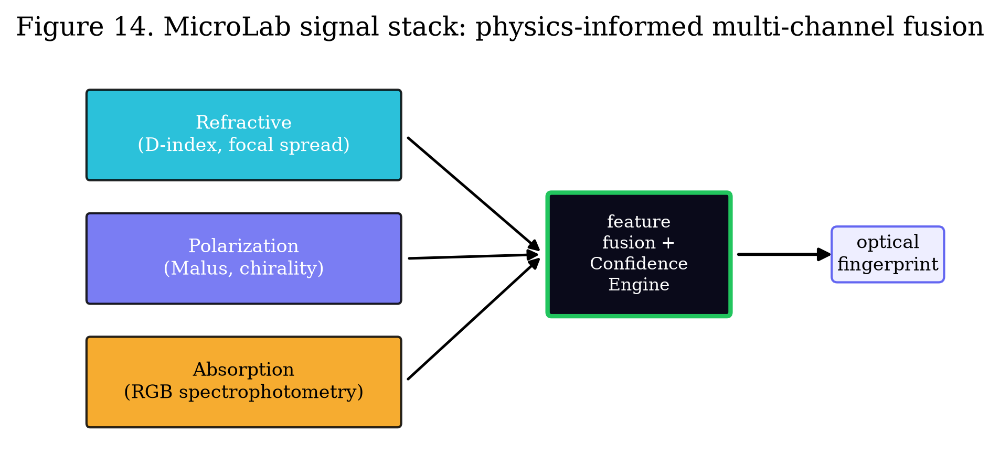

# Computational Optics for Liquid Microsampling: a Multi-Channel Smartphone Sensing Platform

**Author:** Oleg Yuryevich Kirichenko — [urevich55@gmail.com](mailto:urevich55@gmail.com) · GitHub [@infosave2007](https://github.com/infosave2007)
**Series:** Svetoch, Paper V of VI
**Date:** 17 June 2026
**Published:** Zenodo — DOI [10.5281/zenodo.20730337](https://doi.org/10.5281/zenodo.20730337)
**Code & data:** [github.com/infosave2007/svetoch](https://github.com/infosave2007/svetoch) (project, code, 101 experiments) · [github.com/infosave2007/vmf](https://github.com/infosave2007/vmf) (VMF/NVG theory)

---

## Abstract

We describe **MicroLab**, an application of the Svetoch method (Paper I) that turns an
unmodified consumer smartphone into a multi-channel optical sensing platform for liquid
microsamples. The phone's OLED screen is used both as a controllable structured light source
and — through its built-in matrix polarizer — as an opportunistic source of polarized light;
the camera is the detector and the cover glass is an optical element. A microdroplet placed
on a disposable optical barrier is interrogated through three physically independent channels:
**refractive** (a dispersion index $D=C_r/C_b$, focal spread and edge contrast, with a
temperature-drift correction; targets specific gravity, total dissolved solids and protein
trends), **polarization** (Malus-law angle-dependent intensity that reveals optical rotation
of chiral analytes), and **absorption** (RGB spectrophotometry against an empty-lens
baseline). A label-free **frustrated total internal reflection (frustrated-TIR)** mode uses
the cover glass as an evanescent-wave biosensor. The three channels are fused into one
repeatable *optical fingerprint*. The core contribution is not a machine-learning model but a
**validation discipline**: a transfer-matrix self-QA gate that quantifies display→sensor
cross-talk and vignetting via singular-value decomposition, and a **Confidence Engine** that
*rejects* a scan when signal is insufficient or the droplet volume is too small, instead of
guessing. We present the signal stack, the governing relations, a measurement map with
explicit claim levels, and an honest account of confounders and regulatory tiers. MicroLab is
**research-use / wellness-and-food-tech, not a validated medical diagnostic**; medical claims
(especially blood glucose) are explicitly **not** made.

**Keywords:** computational optics, smartphone diagnostics, refractometry, mobile polarimetry,
spectrophotometry, frustrated total internal reflection, sensor fusion, confidence
estimation, research-use-only.

---

## 1. Introduction

A modern smartphone packs, within millimetres of one another, an emissive OLED display, a
high-resolution integrating camera, and a precision-moulded cover glass. Papers I–IV of this
series showed that this hardware computes in light and senses its own physics. Paper V asks a
practical question: **can the same hardware extract a repeatable optical fingerprint from a
single microdroplet of liquid?**

The honest framing matters. We do *not* claim to "measure everything" in a drop. We claim the
narrower and more defensible goal: to extract **stable, physically grounded optical features**
that are robust to droplet geometry and to the hardware variability across phone models. The
platform is architected around three independent optical channels whose fusion yields a
fingerprint, plus a trust layer that knows when *not* to report a number. This validation
discipline — not any individual algorithm — is the asset.

We deliberately separate the platform into trust tiers: food and technical liquids (coffee,
honey, coolant) with zero regulatory risk; wellness trends (hydration, saliva patterns); and
regulated medical claims, which are reserved for after clinical validation and cohort studies.
Figure 14 shows the full signal stack from the three channels through feature fusion and the
Confidence Engine to the optical fingerprint.

*Figure 14. The MicroLab signal stack. Three physically independent channels — refractive
(dispersion index, focal spread, edge contrast), polarization (Malus-law optical rotation),
and absorption (RGB spectrophotometry) — feed a physics-informed feature-fusion layer guarded
by the Confidence Engine, producing one repeatable optical fingerprint of the microdroplet.*

---

## 2. The three-channel signal stack

The technical core is sensor **fusion**, not a single clever trick. Each channel reports
information the others cannot.

### 2.1 Refractive mode — dispersion index and interferometric path

The screen–air-gap–cover-glass–camera path behaves as a refractometer and, with reference
fringe patterns, as a Fabry–Pérot interferometer. The primary engineered feature is a
**dispersion index** built from the camera's own colour channels,

$$
D \;=\; \frac{C_r}{C_b},
$$

the ratio of the red- to blue-channel response of light that has traversed the droplet. Because
the refractive index of a solution depends on wavelength (dispersion) and on dissolved
content, $D$ tracks specific gravity, total dissolved solids (TDS) and protein trends. Two
nuisance terms are handled explicitly: artefacts are averaged out across multi-exposure and
speckle-noise patterns, and a mandatory **temperature-drift correction layer**,
$D_\text{corr}=D-\kappa\,(T-T_0)$, removes the thermo-optic drift caused by local screen
heating.

For transparent media we additionally read the interferometric optical path. In a
Fabry–Pérot-like gap of thickness $d$ filled with a medium of index $n$, the fringe condition
is

$$
2\,n\,d\,\cos\theta \;=\; m\,\lambda ,
$$

so a change in refractive index $\Delta n$ shifts the fringe phase by
$\Delta\phi = (4\pi d\cos\theta/\lambda)\,\Delta n$, measured to sub-pixel precision against
the displayed reference pattern. This yields optical density / concentration without any
moving parts.

### 2.2 Polarization mode — Malus-law optical rotation

OLED panels carry a built-in circular/linear polarizer to suppress ambient reflection, so the
emitted light is already partially polarized. MicroLab treats this as a **free, opportunistic
polarized source**. Displaying a sequence of patterns and analysing the angle-dependent
intensity follows Malus's law,

$$
I(\theta) \;=\; I_0 \cos^2(\theta - \alpha),
$$

where $\alpha$ is the angle through which an optically active (chiral) analyte rotates the
plane of polarization. Fitting $\alpha$ as a function of path length and concentration gives a
saccharimetry-style readout — the classic route to sugars and other chiral species (e.g.
glucose, as an R&D-only feature). This channel is positioned as a research module providing a
differentiation boost rather than a stand-alone diagnostic.

### 2.3 Absorption mode — RGB spectrophotometry

The third channel uses the OLED as a controllable RGB backlight and the camera as a
three-band photometer, applying the Beer–Lambert law,

$$
A_\lambda \;=\; -\log_{10}\!\frac{I_\lambda}{I_{0,\lambda}} \;=\; \varepsilon_\lambda\, c\, \ell ,
$$

where $I_{0,\lambda}$ is the intensity through an **empty-lens baseline** and
$\varepsilon_\lambda$ the molar absorptivity at wavelength band $\lambda$. Green-channel
absorption tracks blood-like samples (haemoglobin); blue-channel attenuation tracks urine
chromophore trends (urobilin). Normalizing every measurement to the empty-lens baseline frame
makes the channel robust to backlight ageing and exposure changes.

---

## 3. Label-free frustrated-TIR sensing

A fourth, label-free modality uses the phone's cover/prism glass as an **evanescent-wave
biosensor**. Display light is coupled into the glass above the critical angle for total
internal reflection (TIR), $\theta_c = \arcsin(n_2/n_1)$. At the glass–sample interface an
evanescent field extends a fraction of a wavelength into the sample. When an analyte — a
droplet, a film, or surface-binding biomolecules — contacts the surface, it **frustrates** the
reflection: light leaks into the higher-index layer and the reflected contrast/interference
pattern read by the camera changes in proportion to the local refractive index and to surface
binding. Scanning the spatial period of the displayed fringes and recording the peak
contrast ratio gives a quantitative response. Because frustrated-TIR is sensitive to the
interface rather than the bulk, it complements the bulk refractive and absorption channels and
adds a route to surface-binding assays. The patent-idea audit rates this mode (A3) as a strong
candidate; here it is disclosed defensively as part of the open fingerprint stack.

---

## 4. Sensor self-QA by transfer-matrix SVD

No optical measurement is trustworthy without a metrology gate. Before any droplet is applied,
MicroLab characterizes the display→lens→sensor chain itself. **Dark (null) frames** and
**calibration patterns** measure anomalous optical leakage and display→sensor cross-talk; a
sequence of one-hot display patterns builds an empirical **transfer matrix** $\mathbf{M}$
mapping displayed sources to sensor responses. Its singular-value decomposition,

$$
\mathbf{M} \;=\; \mathbf{U}\,\boldsymbol{\Sigma}\,\mathbf{V}^{\!\top},
$$

yields the **rank** and **condition number** $\kappa=\sigma_\text{max}/\sigma_\text{min}$ of
the channel — quantitative metrics of vignetting and optical degradation. A degraded or
contaminated lens collapses the small singular values, raising $\kappa$ and lowering the
effective rank; the system then flags the channel as unfit. This is implemented as the
**"Auto-Air" quality gate**: an automatic baseline-aberration check (run on air, before the
sample) that must pass before measurement begins. The audit rates this self-QA method (B3) as
moderate; its value here is operational — it is the first line of the validation discipline.

---

## 5. Feature fusion and the Confidence Engine

The four channels do not vote on a single answer in isolation. Physically grounded
features — $D$ and its temperature-corrected form, focal spread, edge/structure contrast and
standard deviation, Malus-fit rotation angle, per-band absorbances, and the frustrated-TIR
contrast peak — are **fused** into one feature vector. The modelling strategy is deliberately
conservative: physics-informed engineered features first, then a supervised model layered on
top of them, never a black box fed raw pixels.

The decisive component is the **Confidence Engine**, a trust layer that scores every scan and
**rejects** it when the evidence is inadequate — insufficient signal-to-noise, too small a
droplet volume, failed Auto-Air gate, or inconsistency across channels. The product is
allowed, and expected, to say *"not enough data, please re-scan"* rather than emit a confident
guess. Every result carries an explicit status — *estimated*, *trend-only*, or *needs lab
confirmation*. This honesty discipline is the platform's defensible moat: the contribution is
the rejection logic and physically grounded fusion (rated A4, strong), not the classifier.

---

## 6. Measurement map and use-cases

The platform is built bottom-up, from low-regulation, easy-ground-truth scenarios toward
medical trust. Table 1 maps target measurands to their development status and the maximum
claim level we permit.

**Table 1. Measurement map: targets, status and claim level.**

| Target | Status | Why promising | Claim level |
|---|---|---|---|
| Urine specific gravity | Strong MVP | Direct link to refractive index; minimal sample prep | Wellness → clinical (after validation) |
| Coffee TDS / Brix (food) | Strong MVP | Zero regulatory risk; fast feedback loop | Food-tech, immediate |
| Total serum protein | Research candidate | Strong optical tradition | Research-use-only |
| Saliva fertility (ovulation) | Conditional | Large consumer interest | Trend-assistance only, not diagnosis |
| Tear osmolarity trend | Conditional | Niche premium market | Trend-only, later-stage |
| Blood glucose | High-risk R&D | Large market | **No claim** — R&D hypothesis only |

The strongest first products carry no medical risk: coffee TDS/Brix and water checks deliver
revenue and diverse cross-device data immediately. Urine specific gravity is the natural
bridge to a future clinical pilot because the refractive link is direct and the gold-standard
reference (a clinical refractometer) is cheap. Blood glucose is retained only as an open
research hypothesis with **no diagnostic claim whatsoever**.

---

## 7. Methods

**Hardware.** Reference device Xiaomi 12 Lite (6.55" AMOLED, $2400\times1080$, 120 Hz; 32 MP
camera; built-in display polarizer; cover glass used as the TIR/refractive element). A
disposable **optical barrier strip** (system-compatible consumable) sets sterility and a
repeatable optical stack over the lens region.

**Measurement ritual.** (1) Apply the disposable barrier. (2) Run the Auto-Air quality gate —
background-aberration, focus and illumination check via the transfer-matrix SVD, before the
droplet. (3) Apply the droplet with an on-screen volume guide to reduce geometric
variability. (4) Burst-capture while the screen emits the channel-specific pattern sequence
(refractive gradients, polarization sweep, RGB photometry, TIR fringe scan). (5) Fuse
features, run the Confidence Engine, and report with an explicit status. (6) Remove and
discard the barrier.

**Calibration and ground truth.** Each mode has an external reference (standard refractometer,
TDS meter, laboratory assay). Datasets record full context — phone model, screen type, ambient
light, temperature, barrier-film thickness, and timestamped repeat scans for drift estimation.
Features are physics-informed first; supervised models are layered only on top of engineered
features.

**Software.** Built on the Svetoch on-device stack (Paper I): a dependency-free server relays
control to the phone, which renders patterns, captures frames, normalizes to the empty-lens
baseline, computes per-channel features, and posts results with confidence scores.

---

## 8. Discussion: hard truths

**Confounders as measurable nuisance variables.** Sample inhomogeneity, ambient-light
leakage, barrier-film microcracks, and local screen overheating are real and unavoidable.
MicroLab does not pretend they are absent; it treats them as **measurable nuisance variables**
handled by quality gates: multi-exposure and speckle averaging suppress inhomogeneity, the
empty-lens baseline and Auto-Air gate catch leakage and film defects, and the temperature-drift
layer corrects thermo-optic error. When a confounder cannot be bounded, the Confidence Engine
rejects the scan.

**Regulatory tiers.** Claims are split explicitly into *educational*, *wellness*,
*research-use-only*, and *regulated diagnostic*. The first three are available now; the last is
reserved strictly for after clinical validation and cohort studies on a single bio-scenario
against a gold standard (the planned pilot is urine specific gravity in a clinic). Crossing
tiers is a regulatory event, not a software update.

**Explicit non-medical claims.** MicroLab as described is **not a validated medical diagnostic
device**. It is a research-use, wellness, and food-tech instrument for extracting repeatable
optical features. No diagnostic claim is made for any biofluid, and **blood glucose is
explicitly excluded** from any present claim — it remains an R&D hypothesis only. The
contribution we stand behind is the *honesty and confidence discipline*: a system that refuses
to guess.

**Patentability context.** The internal audit rates the polarimetry (A2), frustrated-TIR
biosensor (A3) and multimodal fusion with the Confidence Engine (A4) as strong, and the mobile
interferometer/refractometer (B2) and sensor self-QA (B3) as moderate. We publish all of them
openly here as a defensive disclosure.

---

## 9. Conclusion

A smartphone can be a multi-channel optical sensing platform. By combining a refractive
dispersion channel, an opportunistic Malus-law polarization channel, RGB absorption
spectrophotometry, and label-free frustrated-TIR sensing, MicroLab extracts a repeatable
optical fingerprint from a single microdroplet. Guarded by a transfer-matrix self-QA gate and
a Confidence Engine that rejects untrustworthy scans, the platform is honest about what it can
and cannot measure. The validation discipline — not the machine learning — is the
contribution, and the medical tier remains explicitly off-limits until clinical validation.

---

## Data and code availability

All code, the on-device experiment stages underlying the channels (refractive, polarization,
absorption, frustrated-TIR, self-QA), and the figure scripts are at
https://github.com/infosave2007/svetoch (Apache-2.0); the related VMF/NVG theory is at https://github.com/infosave2007/vmf.

## Acknowledgements / Priority note

This manuscript is released as a **defensive publication** to establish the author's authorship
and the date of disclosure of the methods described. The author has elected not to seek patent
protection.

## References (indicative)

**Companion paper (Svetoch I):** O. Yu. Kirichenko, "Optical Neural Computation on a Commodity Smartphone: the OLED–Mirror–Camera Channel as an Analog Matrix Engine," Zenodo (2026). https://doi.org/10.5281/zenodo.20729632

1. B. Edlén, "The refractive index of air," *Metrologia* **2**, 71 (1966).
2. E. Hecht, *Optics*, 5th ed., Pearson, 2017 (Malus's law; polarimetry / saccharimetry).
3. D. F. Swinehart, "The Beer–Lambert law," *J. Chem. Educ.* **39**, 333 (1962).
4. X. Fan et al., "Sensitive optical biosensors for unlabeled targets: a review,"
   *Anal. Chim. Acta* **620**, 8 (2008) (evanescent-wave / frustrated-TIR biosensing).
5. A. Ozcan and E. McLeod, "Lensless imaging and sensing," *Annu. Rev. Biomed. Eng.* **18**,
   77 (2016) (smartphone / computational diagnostics).
6. G. H. Golub and C. F. Van Loan, *Matrix Computations*, 4th ed., Johns Hopkins, 2013
   (singular-value decomposition / system characterization).

---

*Part of the Svetoch series (defensive publication, not patented). Released for the public
record to establish authorship and priority.*
