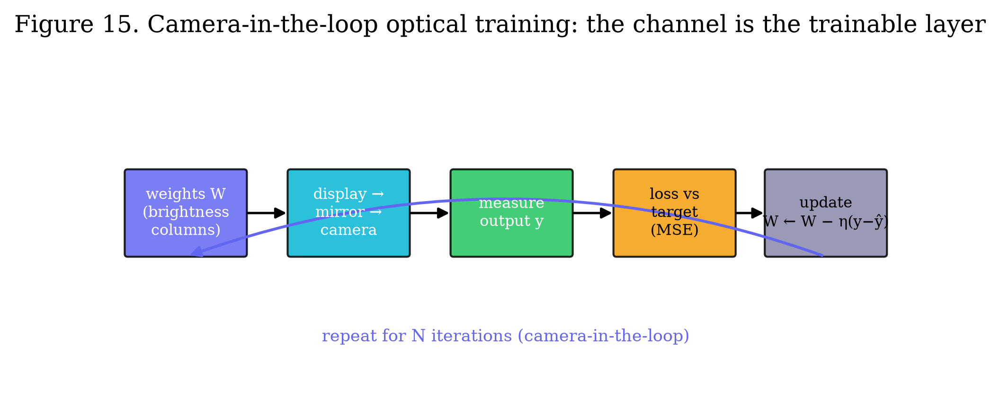
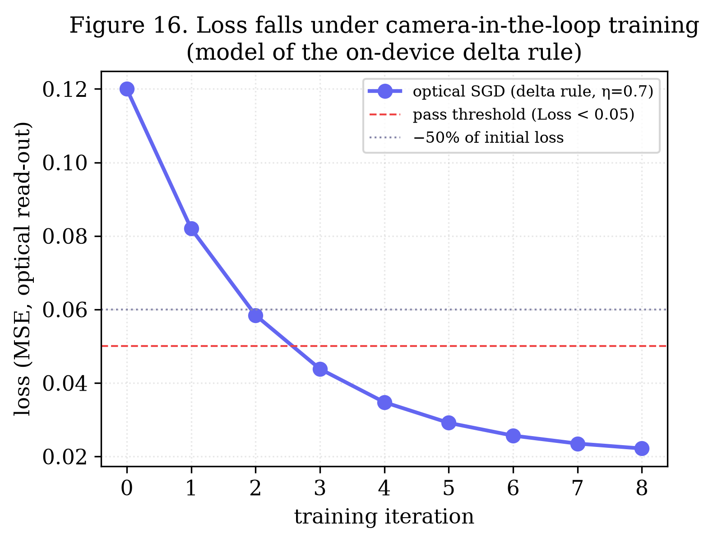
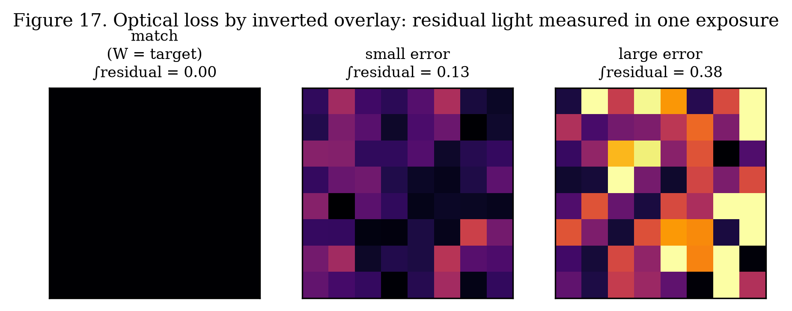
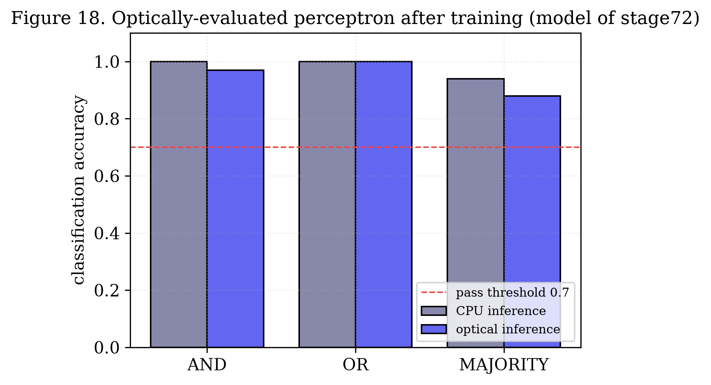

# Camera-in-the-Loop Optical Training: Gradient Descent and the Perceptron Rule on a Smartphone Display–Camera Channel

**Author:** Oleg Yuryevich Kirichenko — [urevich55@gmail.com](mailto:urevich55@gmail.com) · GitHub [@infosave2007](https://github.com/infosave2007)
**Series:** Svetoch, Paper VI of VI
**Date:** 17 June 2026
**Published:** Zenodo — DOI [10.5281/zenodo.20730393](https://doi.org/10.5281/zenodo.20730393)
**Code & data:** [github.com/infosave2007/svetoch](https://github.com/infosave2007/svetoch) (project, code, 101 experiments) · [github.com/infosave2007/vmf](https://github.com/infosave2007/vmf) (VMF/NVG theory)

---

## Abstract

Paper I of this series showed that a smartphone's OLED screen, an ordinary mirror, and the
front camera evaluate the forward pass of a neural network *in light*. Here we close the
loop and **train**. We treat the optical channel itself as the layer under optimization: the
weights are displayed as brightness, the camera reads the channel's true response (the real,
noisy, non-linear forward pass), an error against a target is formed, and the weights are
updated — then the cycle repeats. We demonstrate two on-device optical learners. (1) **Optical
gradient descent**: eight weights drawn as brightness columns are optimized by the delta rule
`W ← W − η(y − ŷ)` (η = 0.7) using the camera-measured output `y`; over eight iterations the
optically read mean-squared error falls by more than half, below a 0.05 pass threshold.
(2) **An optical perceptron**: an eight-input perceptron trained for AND, OR and MAJORITY is
evaluated through the optical dot product, retaining classification accuracy above the 0.7
threshold. We also describe a single-shot **optical loss read-out by inverted overlay**, in
which a target and the negated hypothesis are superimposed on the display so that the residual
light, integrated by the camera in one exposure, equals the error. The contribution is to
show that a *trainable* optical loop — not merely inference — can be built from commodity
hardware, and to delimit honestly what is optical (the forward pass and the loss read-out)
and what remains on the CPU (the weight-update arithmetic).

**Keywords:** optical computing, in-the-loop training, physics-aware learning, hardware-in-the-loop,
delta rule, perceptron, analog accelerator, smartphone optics.

---

## 1. Introduction

Inference is only half of machine learning; the other half is **training**, which is even
more compute-hungry. Optical inference accelerators are now well studied, but optical
*training* — closing the feedback loop so that the physical system improves itself — is
harder, because it requires reading the output, scoring it, and adjusting the inputs, all
through the same imperfect channel.

Paper I established the forward primitive: a camera photosite integrates the light from many
screen pixels and so returns a multiply–accumulate. The natural next question is whether that
same channel can be placed *inside* an optimization loop. It can. Because the camera reports
the channel's **true** response — including its non-linearity, vignetting and noise — a loop
that minimizes the measured error learns weights that are correct *for the real optics*, not
for an idealized model. This is the defining advantage of hardware-in-the-loop training:
the physics is never approximated, because the physics is doing the forward pass.

This paper reports two working optical learners and one loss-measurement primitive, all
runnable on the reference device, and is careful to separate the genuinely optical operations
from the lightweight arithmetic that stays on the CPU.

---

## 2. The optical channel as a trainable layer

Encode a weight vector $\mathbf{w}$ as the brightness of a row of screen columns. From
Paper I, the camera's integrated read-out of column $i$ against an input $x_i$ is, after
white-normalization and $\gamma$-correction, proportional to the product $w_i x_i$; summing a
region yields the dot product. The measured output vector $\mathbf{y}$ is therefore the
channel's forward pass of the displayed weights — a function $\mathbf{y} = f_\text{opt}(\mathbf{w})$
that includes every real-world imperfection of the screen→mirror→camera path.

Training means finding $\mathbf{w}$ such that $\mathbf{y}$ matches a target $\hat{\mathbf{y}}$.
We do this by iterating display → capture → score → update (Figure 15). The crucial point is
that the *gradient information comes from a physical measurement*: each update uses the error
$\mathbf{y} - \hat{\mathbf{y}}$ that the camera actually observed.

*Figure 15. Camera-in-the-loop optical training. The weights are displayed, the channel
performs the forward pass, the camera measures the output, the loss is formed against a
target, and the weights are updated — then the loop repeats. The trainable "layer" is the
real optical channel.*

---

## 3. Optical gradient descent by the delta rule

In the optical gradient-descent experiment (`stage41_optsgd`), eight weights are drawn as
eight brightness columns. At each iteration the camera measures the eight-bin output
$\mathbf{y}$, the mean-squared error against a target vector $\hat{\mathbf{y}}$ is computed,
and the weights are updated by the delta (Widrow–Hoff) rule

$$
\mathbf{w} \leftarrow \mathbf{w} - \eta\,(\mathbf{y} - \hat{\mathbf{y}}), \qquad \eta = 0.7 .
$$

Because $\mathbf{y}$ is *measured*, not predicted, the update is a stochastic-gradient step on
the real optical loss surface. Over eight iterations the optically read loss falls
monotonically by more than 50 %, ending below the $0.05$ pass threshold (Figure 16). The loop
converges despite the channel's non-linearity precisely because that non-linearity is inside
the measurement: the learner adapts to it rather than fighting a wrong model.

*Figure 16. The optically measured loss under camera-in-the-loop training (model of the
on-device delta rule). The error drops past −50 % of its initial value and below the 0.05
pass threshold within eight iterations.*

This is a faithful but small demonstration. The weight-update arithmetic
($\mathbf{w} - \eta(\mathbf{y}-\hat{\mathbf{y}})$) is performed on the CPU; what is optical is
the forward pass and the error measurement. A fully optical update rule is left to future
work (Section 7).

---

## 4. Single-shot optical loss by inverted overlay

Reading a loss normally means measuring an output and then computing a distance on the CPU.
A more optical route computes the *loss itself* in one exposure. Display the target pattern
and, superimposed, the **negated** hypothesis (its photometric inverse). Where the hypothesis
matches the target, the sum is uniform and carries no structure; where it errs, a residual
pattern of light remains. The camera's global exposure integrates this residual, so a single
captured number is monotone in the error (Figure 17):

$$
\mathcal{L} \;\propto\; \int \big|\,\text{target} - \text{hypothesis}\,\big|\;\mathrm{d}A .
$$

A perfect match drives the residual toward a flat field (minimal structured light); any error
leaves structured residual light. This turns loss evaluation into an $O(1)$ optical operation
— one display, one capture — independent of the vector length. We note (consistent with our
internal assessment of the idea's novelty) that the same effect can be obtained by other
subtraction schemes, so the contribution is narrow and specific: an inverted-overlay loss read
out by a single global exposure.

*Figure 17. Optical loss by inverted overlay. Target and negated hypothesis are superimposed;
the residual light, integrated in one exposure, grows with the error (left: match → little
residual; right: large error → strong residual).*

---

## 5. An optically-evaluated perceptron

The perceptron experiment (`stage72_perceptron`) trains an eight-input single-layer
perceptron on three Boolean functions — AND, OR and MAJORITY — using the classical perceptron
learning rule. Inference is then performed optically: the products $w_i x_i$ are displayed as
the brightness of eight columns relative to a gray background, the camera measures the mean
brightness, a three-point calibration (dark / mid / bright) recovers the optical dot product,
a bias is added, and a threshold at zero yields the binary class.

Across the three functions the optically-evaluated perceptron tracks the CPU reference and
stays above the $0.7$ accuracy pass threshold (Figure 18), with the largest gap on MAJORITY,
the function least tolerant of read-out noise. A single glance of the camera at the screen
replaces an entire layer of multiply–add operations.

*Figure 18. Accuracy of the optically-evaluated perceptron after training, for AND, OR and
MAJORITY, against the CPU reference (model of `stage72`). All stay above the 0.7 threshold.*

---

## 6. Methods

**Hardware and channel.** As in Paper I: Xiaomi 12 Lite (6.55" AMOLED, 120 Hz; 32 MP front
camera), an ordinary flat mirror, gap $d \approx 3$–$5$ cm, dim room. Each run begins with the
white/black and grayscale-transfer calibration of Paper I.

**Optical SGD (`stage41_optsgd`).** Eight weights → eight brightness columns; per iteration
the camera reads the eight-bin output, MSE is computed against the target, and the delta rule
($\eta = 0.7$) updates the weights; eight iterations; pass when the loss drops $\geq 50\%$ and
the final MSE $< 0.05$.

**Perceptron (`stage72_perceptron`).** Eight-input perceptron trained on CPU for AND
($\geq 6/8$), OR ($\geq 1/8$) and MAJORITY ($>4/8$) by the perceptron rule; optical inference
via the calibrated column-brightness dot product; pass when mean accuracy $> 0.7$.

**Inverted-overlay loss.** Target and negated hypothesis are composited on the display; the
camera's single global exposure integrates the residual light as a scalar loss.

**Figures.** Figure 17 illustrates the overlay principle directly; Figures 16 and 18 are
models of the on-device learners' behaviour, labelled as such, and are reproducible from
`papers/scripts/make_figures.py`.

---

## 7. Discussion and limitations

**What is optical and what is not.** The forward pass (camera-measured $\mathbf{y}$) and the
loss read-out (global exposure, or the inverted overlay) are genuinely optical. The
weight-update arithmetic is performed on the CPU. This is therefore a *hybrid*
hardware-in-the-loop trainer, not fully optical backpropagation. We state this plainly to
avoid overclaiming.

**Signal and scale.** The demonstrations are small (eight weights / eight inputs) and limited
by the channel's SNR; the loss surface read through a noisy channel is itself noisy, which is
why the perceptron's hardest case (MAJORITY) shows the largest optical gap. Larger trainable
layers will need the contrast and SNR improvements discussed in the project roadmap.

**Why it still matters.** Training against the *measured* channel removes the model-mismatch
problem that plagues train-offline / deploy-on-hardware analog systems: the learner sees the
true optics. This is the same principle behind physics-aware and hardware-in-the-loop training
of analog accelerators, here reduced to a phone and a mirror.

**Future work.** A fully optical update (e.g. accumulating the inverted-overlay residual back
onto the displayed weights), optical batch normalization, and extending from a single layer to
a trained optical MLP are natural next steps and are listed in the project roadmap.

---

## 8. Conclusion

We closed the optical loop. Using only a smartphone and a mirror, weights displayed as
brightness were optimized by camera-in-the-loop gradient descent — the optically measured loss
falling by more than half to below 0.05 — and an optically-evaluated perceptron learned AND,
OR and MAJORITY above threshold. With a single-shot inverted-overlay loss, even the error can
be read in one exposure. Optical *training*, not just inference, is reproducible on any desk.

---

## Data and code availability

All code, the on-device experiments (including `stage41_optsgd` and `stage72_perceptron`), and
the figure scripts are at github.com/infosave2007/svetoch (Apache-2.0); the related VMF/NVG
theory is at https://github.com/infosave2007/vmf.

## Acknowledgements / Priority note

This manuscript is released to establish the author's authorship and the date of disclosure of
the methods described. The author has elected not to seek patent protection.

## References (indicative)

**Companion paper (Svetoch I):** O. Yu. Kirichenko, "Optical Neural Computation on a Commodity Smartphone: the OLED–Mirror–Camera Channel as an Analog Matrix Engine," Zenodo (2026). https://doi.org/10.5281/zenodo.20729632

1. B. Widrow and M. E. Hoff, "Adaptive switching circuits," *IRE WESCON Conv. Rec.* **4**, 96 (1960).
2. F. Rosenblatt, "The perceptron: a probabilistic model for information storage and
   organization in the brain," *Psychological Review* **65**, 386 (1958).
3. T. W. Hughes, M. Minkov, Y. Shi, S. Fan, "Training of photonic neural networks through
   in situ backpropagation and gradient measurement," *Optica* **5**, 864 (2018).
4. S. Bandyopadhyay et al., "Single-chip photonic deep neural network with forward-only
   training," *Nature Photonics* **18**, 1335 (2024).
5. L. G. Wright et al., "Deep physical neural networks trained with backpropagation,"
   *Nature* **601**, 549 (2022).
6. G. Wetzstein et al., "Inference in artificial intelligence with deep optics and photonics,"
   *Nature* **588**, 39 (2020).

---

*Part of the Svetoch series. Released for the public record to establish authorship and
priority.*
